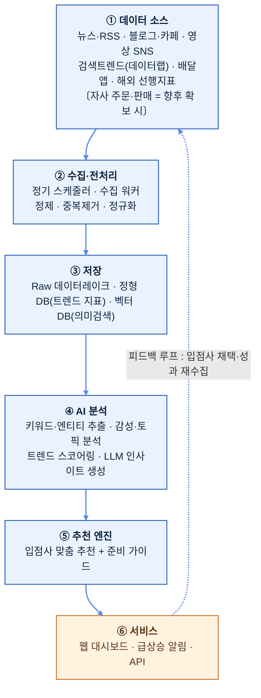

# 01. AI 기반 디저트 트렌드 분석·추천 시스템 (안건 1)

> **한 줄 요약**: 뉴스·블로그·SNS·검색·커머스 데이터를 정기 수집하고 AI로 분석하여, "곧 뜰 디저트 아이템"을 조기에 포착해 딸기로 입점 업체에게 맞춤 추천하는 SaaS형 웹 서비스.

---

## 1. 문제 정의 (Why)

디저트 시장은 **트렌드 수명이 짧고 변동이 극심**하다(예: 약과·두바이초콜릿·소금빵·크룽지 등이 수개월 단위로 부침). 입점 업체(소상공인 제조사)는:

- 트렌드를 **뒤늦게** 인지 → 유행 정점이 지난 뒤 진입 → 재고·설비 손실.
- 어떤 아이템이 **자기 업장 역량에 맞는지** 판단할 근거가 없음.
- 트렌드 정보가 흩어져 있고(뉴스·인스타·유튜브·배달앱), 수동 모니터링은 비현실적.

**딸기로의 기회**: 흩어진 **인터넷 공개 데이터(뉴스·블로그·SNS·검색·커머스)를 체계적으로 정기 취합·AI 분석**하면, 개별 업체가 수동으로는 도저히 못 하는 속도·범위로 "다음에 뜰 것"을 조기 포착할 수 있다.
> **전제(현 시점)**: 딸기로는 **자체 보유 데이터가 없다**. 따라서 본 시스템은 **인터넷 공개 데이터만으로 부트스트랩**한다(상세: [03_인터넷데이터_활용방법.md](03_인터넷데이터_활용방법.md)). 서비스 운영을 통해 축적되는 **추천→채택→성과 피드백 데이터**가 시간이 지날수록 고유 자산(데이터 해자)이 된다. 입점사 성공 → 거래액 증가 → 데이터 축적 → 추천 정확도 향상의 **선순환**을 목표로 한다.

## 2. 솔루션 개요 (What)

3계층 가치 제공:

| 계층 | 기능 | 사용자 가치 |
|------|------|-------------|
| **포착(Detect)** | 인터넷 전반 신호를 정기 수집·정규화 | 흩어진 정보를 한 곳에서 |
| **예측(Predict)** | AI가 트렌드 성장 곡선·수명·성공 가능성 스코어링 | "정점 전" 조기 진입 타이밍 |
| **추천(Recommend)** | 입점사 업종·역량·지역 맞춤 아이템 + 준비 가이드 | 실행 가능한 의사결정 |

산출 채널: **딸기로 자체 웹 대시보드 + 알림(급상승 아이템 푸시)**.

## 3. 시스템 아키텍처

핵심은 **흩어진 인터넷 신호를 한 파이프라인으로 통합**하는 점, 그리고 **피드백 루프**(추천→채택·성과 재수집)로 예측 정확도를 지속 개선하는 점이다. (현 시점 자사 거래 데이터는 없으며 향후 확보 시 결합 — [03_인터넷데이터_활용방법.md](03_인터넷데이터_활용방법.md))

## 4. 데이터 수집 (Data Ingestion)

### 4.1 소스 분류
| 카테고리 | 소스 예시 | 신호 의미 | 수집 방식 |
|----------|-----------|-----------|-----------|
| 뉴스/언론 | 네이버 뉴스 API, 언론사 RSS, 구글 뉴스 | 업계·유행 공식화 신호 | API/RSS |
| 블로그/커뮤니티 | 네이버 블로그·카페, 디시·더쿠 | 초기 입소문 | API/크롤 |
| 영상 SNS | 유튜브, 틱톡, 인스타 릴스(해시태그) | 바이럴 폭발 선행지표 | API/공식 데이터 |
| 검색 수요 | 네이버 데이터랩, 구글 트렌드 | 실수요 정량화 | 공식 API |
| 커머스 | 배민·쿠팡이츠 인기메뉴, 오픈마켓 디저트 랭킹 | 실제 구매 전환 | 크롤 (자사 판매 데이터는 **향후** 확보 시 결합) |
| 해외 선행 | 일본·유럽·미국 디저트 트렌드 매체 | K-디저트의 6~12개월 선행 신호 | RSS/번역 크롤 |

> ⚖️ **법적 주의**: 크롤링은 각 사이트 robots.txt·이용약관·저작권·개인정보를 준수. 가능하면 **공식 API 우선**, 불가 시 메타데이터/통계만 수집하고 원문 전재는 지양. TIPS 제안 시에도 "합법적 데이터 수집 거버넌스"를 명시하면 신뢰도 ↑.

### 4.2 정기 취합
- **스케줄링**: 소스별 주기 차등(뉴스 1일, SNS 6시간, 검색트렌드 1일). MVP는 cron/관리형 스케줄러, 확장 시 Airflow/Dagster.
- **정제**: 중복 제거, 디저트 도메인 외 노이즈 필터, 텍스트 정규화, 언어 감지/번역.

## 5. AI 분석 파이프라인 (핵심 R&D 영역)

수집 데이터에 대해 단계적으로 AI를 적용한다.

### 5.1 추출 (Extraction)
- **개체명 인식(NER)**: 텍스트에서 디저트명·재료·맛·브랜드·지역 추출. (디저트 도메인 특화 사전 + LLM 보정)
- **신규 엔티티 발견**: 사전에 없던 신조어/신메뉴 자동 탐지 → "초기 트렌드 후보"로 등록.

### 5.2 의미 분석 (Understanding)
- **감성 분석**: 언급의 긍/부정/중립 + 강도. (단순 빈도가 아니라 "호감도"를 반영)
- **토픽 모델링/임베딩 클러스터링**: 의미 유사 언급을 군집화해 "떠오르는 테마"(예: '저당 디저트', '레트로 간식') 도출.

### 5.3 트렌드 스코어링 (예측 — 차별화 핵심)
각 아이템에 대해 다단계 지표 산출:
- **모멘텀 스코어**: 언급량 증가율(1차·2차 미분) — 절대량보다 "가속도" 중시.
- **확산 단계 분류**: 태동기 → 성장기 → 정점 → 쇠퇴기 (S-curve 피팅). **"성장기 진입 직후"를 추천 타이밍으로 정의.**
- **수명 예측**: 유사 과거 트렌드의 곡선과 비교(시계열 유사도)해 잔존 기간 추정.
- **계절성·지역성 보정**.
- **신뢰도**: 소스 다양성·자사 데이터 일치 여부로 가중.

### 5.4 LLM 인사이트 생성 (Claude 활용)
- 정량 지표 + 원천 근거를 **Claude API**에 입력 → 사람이 읽을 **"왜 뜨는가 / 누가 만들면 좋은가 / 어떻게 준비하나"** 자연어 브리핑 자동 생성.
- **근거 추적(citation)**: 인사이트마다 출처 링크를 첨부해 신뢰성과 검증가능성 확보.
- 환각 방지: 정량 지표는 코드로 계산하고 LLM은 **설명·요약·추천 문장 생성**에 한정(계산을 LLM에 맡기지 않음).

> 모델 운영: 대량 분류·요약은 저비용 모델(Haiku), 심층 인사이트·전략 브리핑은 고성능 모델(Sonnet/Opus)로 **티어링**해 비용 최적화. (정확 수치는 `claude-api` 스킬로 확인 후 비용표에 반영)

## 6. 추천 엔진

입점사별 맞춤 추천. 입력: ① 트렌드 스코어 ② 입점사 프로필(업종·생산설비·가격대·지역·과거 판매).

- **적합도 매칭**: "뜨는 아이템" 중 해당 업장이 **실제로 만들 수 있고 수익 날** 것만 우선순위화.
- **준비 가이드 동봉**: 예상 원가/마진, 레시피 난이도, 필요 설비, 권장 진입 시점, 예상 트렌드 잔존 기간.
- **조기 경보 알림**: 급상승 신호 감지 시 적합 입점사에게 푸시(웹/이메일/카카오).
- **개인화 고도화(확장)**: 입점사 채택·판매 성과를 학습해 추천 정확도 개선(피드백 루프).

## 7. 웹 플랫폼 (입점사 대면)

- **트렌드 대시보드**: 실시간 랭킹, 상승/하락 무버, 카테고리별 히트맵.
- **아이템 상세**: 성장 곡선, 확산 단계, 근거 데이터·출처, 예측 수명, AI 브리핑.
- **나의 추천**: 입점사 맞춤 Top-N + 준비 가이드.
- **알림 센터**: 급상승 조기 경보.
- **관리자**: 데이터 소스·수집 상태·모델 품질 모니터링.

## 8. 기술 스택 (제안 예시)

| 영역 | MVP 권장 | 확장 |
|------|----------|------|
| 수집/스케줄 | Python + cron/관리형 스케줄러 | Airflow/Dagster, 메시지 큐 |
| 저장 | PostgreSQL + 객체 스토리지 | + 벡터 DB(pgvector→전용), 데이터웨어하우스 |
| AI/LLM | Claude API(Haiku/Sonnet 티어링), 오픈소스 임베딩 | 도메인 파인튜닝/자체 스코어링 모델 |
| 백엔드 | FastAPI/Node | 마이크로서비스 |
| 프론트 | Next.js + 차트 라이브러리 | — |
| 인프라 | 단일 클라우드(관리형) | 컨테이너 오케스트레이션, IaC |

> 스택은 딸기로 기존 기술 자산에 맞춰 조정 (현재 개발 환경 확인 필요 — PROGRESS.md 미해결 항목).

## 9. 단계적 로드맵 (MVP → 확장)

### Phase 0 — 검증 PoC (1~2개월)
- 소스 2~3종(네이버 뉴스+데이터랩+1 SNS)만 수집, 수동 분석 병행.
- Claude API로 주간 트렌드 브리핑 자동 생성 → 소수 입점사에 수동 전달.
- **목표**: "AI 브리핑이 실제로 유용한가" 가설 검증. (낮은 비용/인력)

### Phase 1 — MVP 웹 서비스 (3~5개월)
- 자동 수집 파이프라인 + 트렌드 스코어링 v1 + 웹 대시보드 + 알림.
- 자사 주문 데이터 연동 시작. 일부 입점사 베타.

### Phase 2 — 추천 개인화 & 정확도 (6~9개월)
- 입점사 프로필 기반 맞춤 추천, 피드백 루프 구축, 예측 정확도 KPI 측정.

### Phase 3 — 고도화 & 확장 (10개월~)
- 도메인 특화 모델/파인튜닝, 해외 선행지표, 외부 SaaS 판매 가능성 검토.

## 10. TIPS 포지셔닝 (제안서 논리)

### 10.1 기술성 / R&D 도전 과제 (심사 핵심)
단순 크롤링·대시보드가 아니라, **연구개발이 필요한 명확한 난제**가 있음을 강조:
1. **트렌드 조기 예측 모델**: 노이즈 많은 멀티소스 신호에서 "정점 전 성장기"를 식별하는 시계열·확산 모델 — 정확도가 곧 차별화.
2. **도메인 특화 NER/신조어 탐지**: 디저트 신메뉴·신조어를 실시간 자동 발견.
3. **멀티모달·멀티소스 융합**: 텍스트·영상·검색·거래 데이터를 하나의 스코어로 통합하는 가중·신뢰도 모델.
4. **LLM 환각 통제형 인사이트 생성**: 정량 계산과 LLM 생성의 책임 분리 + 근거 추적 아키텍처.

### 10.2 혁신성·차별성
- **데이터 해자(moat)**: 초기엔 누구나 접근 가능한 인터넷 데이터로 시작하지만, **(a) 도메인 특화 정제·스코어링 파이프라인, (b) 추천→채택→성과 피드백으로 축적되는 고유 라벨링 데이터셋**이 시간이 지날수록 복제 난도를 높인다. (향후 자사 거래 데이터까지 결합하면 해자 강화)
- **선순환 구조**: 추천→입점사 성과→재학습으로 시간이 지날수록 정확해지는 자산.
- 일반 트렌드 분석 툴과 달리 **"실행 가능한 추천 + 준비 가이드"**까지 제공.

### 10.3 사업화 / 시장성
- 입점사 성공률↑ → 거래액↑ → 딸기로 매출↑ (직접 연결).
- 확장: 동 시스템을 **B2B SaaS**(타 F&B 플랫폼·프랜차이즈·식품 제조사)로 판매 가능.
- 데이터 기반 신메뉴 컨설팅, 자체 PB 디저트 기획 등 파생 사업.

### 10.4 성과 지표(KPI) 예시
- 예측 정확도(추천 아이템의 실제 성장 적중률), 추천 채택률, 채택 입점사 매출 증가율, 조기 경보 리드타임(경쟁 대비 며칠 빠른가).

## 11. 리스크 & 대응

| 리스크 | 대응 |
|--------|------|
| 크롤링 법적 이슈 | 공식 API 우선, robots/약관 준수, 메타데이터 중심, 법무 검토 |
| 데이터 노이즈/광고성 글 | 광고·바이럴 마케팅 글 필터링 모델, 소스 신뢰도 가중 |
| 예측 빗나감 | 확률·신뢰도 함께 제시, 피드백 루프로 보정, 인간 검수(초기) |
| LLM 환각·비용 | 계산-생성 책임 분리, 모델 티어링, 캐싱, 출처 추적 |
| 콜드스타트(데이터 부족) | 해외 선행지표·과거 트렌드 사례로 부트스트랩 |

## 12. 다음 작업 메모
- 딸기로 실제 개발 자원/예산/보유 데이터 확인 후 §8 스택·§9 일정·비용표 구체화.
- 비용 산정표 추가 시 Claude 모델 단가는 `claude-api` 스킬로 확인.
- 평가 항목별(기술성/사업성/팀) 제안서 챕터 매핑이 필요하면 별도 문서로 분리.
