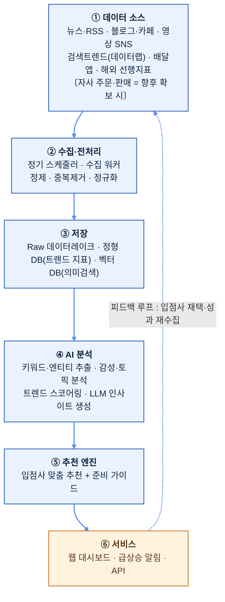

# 02. AI 기반 디저트 트렌드 분석·추천 시스템 (안건 1)

> **한 줄 요약**: 뉴스·블로그·SNS·검색·커머스 데이터를 정기 수집하고 AI로 분석하여, "곧 뜰 디저트 아이템"을 조기에 포착해 딸기로 입점 업체에게 맞춤 추천하는 SaaS형 웹 서비스.

---

## 1. 문제 정의 (Why)

디저트 시장은 **트렌드 수명이 짧고 변동이 극심**하다(예: 약과·두바이초콜릿·소금빵·크룽지 등이 수개월 단위로 부침). 입점 업체(소상공인 제조사)는:

- 트렌드를 **뒤늦게** 인지 → 유행 정점이 지난 뒤 진입 → 재고·설비 손실.
- 어떤 아이템이 **자기 업장 역량에 맞는지** 판단할 근거가 없음.
- 트렌드 정보가 흩어져 있고(뉴스·인스타·유튜브·배달앱), 수동 모니터링은 비현실적.

**딸기로의 기회**: 흩어진 **인터넷 공개 데이터(뉴스·블로그·SNS·검색·커머스)를 체계적으로 정기 취합·AI 분석**하면, 개별 업체가 수동으로는 도저히 못 하는 속도·범위로 "다음에 뜰 것"을 조기 포착할 수 있다.
> **전제(2026-06-18 업데이트)**: 딸기로(딸기로픽, 동일 법인)는 **자사 실거래 데이터 + 픽미팀과의 정식 공동연구 산출물(트렌드 분석 대시보드 = 본 시스템의 선행 PoC, 방법론 4종 상세 [07](07_픽미공동연구_분석방법론.md))** 을 이미 보유한다 → **데이터 해자**. 특히 공동연구의 **시계열 분석 기법**([07 §1](07_픽미공동연구_분석방법론.md))은 본 시스템 백테스팅의 **베이스라인(자체 v1)** 이다. 본 시스템은 이 자사 데이터를 **인터넷 공개 데이터**(전국 비입점·신규 트렌드 보완축, 상세: [04_인터넷데이터_활용방법.md](04_인터넷데이터_활용방법.md))와 결합해 고도화한다. 추가로 서비스 운영의 **추천→채택→성과 피드백 데이터**가 해자를 강화하는 **선순환**을 목표로 한다.

## 2. 솔루션 개요 (What)

3계층 가치 제공:

| 계층 | 기능 | 사용자 가치 |
|------|------|-------------|
| **포착(Detect)** | 인터넷 전반 신호를 정기 수집·정규화 | 흩어진 정보를 한 곳에서 |
| **예측(Predict)** | AI가 트렌드 성장 곡선·수명·성공 가능성 스코어링 | "정점 전" 조기 진입 타이밍 |
| **추천(Recommend)** | 입점사 업종·역량·지역 맞춤 아이템 + 준비 가이드 | 실행 가능한 의사결정 |

산출 채널: **딸기로 자체 웹 대시보드 + 알림(급상승 아이템 푸시)**.

## 3. 시스템 아키텍처

핵심은 **흩어진 인터넷 신호를 한 파이프라인으로 통합**하는 점, 그리고 **피드백 루프**(추천→채택·성과 재수집)로 예측 정확도를 지속 개선하는 점이다. (현 시점 자사 거래 데이터는 없으며 향후 확보 시 결합 — [04_인터넷데이터_활용방법.md](04_인터넷데이터_활용방법.md))

## 4. 데이터 수집 (Data Ingestion)

### 4.1 소스 분류
| 카테고리 | 소스 예시 | 신호 의미 | 수집 방식 |
|----------|-----------|-----------|-----------|
| 뉴스/언론 | 네이버 뉴스 API, 언론사 RSS, 구글 뉴스 | 업계·유행 공식화 신호 | API/RSS |
| 블로그/커뮤니티 | 네이버 블로그·카페, 디시·더쿠 | 초기 입소문 | API/크롤 |
| 영상 SNS | 유튜브, 틱톡, 인스타 릴스(해시태그) | 바이럴 폭발 선행지표 | API/공식 데이터 |
| 검색 수요 | 네이버 데이터랩, 구글 트렌드 | 실수요 정량화 | 공식 API |
| 커머스 | 배민·쿠팡이츠 인기메뉴, 오픈마켓 디저트 랭킹 | 실제 구매 전환 | 크롤 (자사 판매 데이터는 **향후** 확보 시 결합) |
| 해외 선행 | 일본·유럽·미국 디저트 트렌드 매체 | K-디저트의 6~12개월 선행 신호 | RSS/번역 크롤 |

> ⚖️ **법적 주의**: 크롤링은 각 사이트 robots.txt·이용약관·저작권·개인정보를 준수. 가능하면 **공식 API 우선**, 불가 시 메타데이터/통계만 수집하고 원문 전재는 지양. TIPS 제안 시에도 "합법적 데이터 수집 거버넌스"를 명시하면 신뢰도 ↑.

### 4.2 정기 취합
- **스케줄링**: 소스별 주기 차등(뉴스 1일, SNS 6시간, 검색트렌드 1일). MVP는 cron/관리형 스케줄러, 확장 시 Airflow/Dagster.
- **정제**: 중복 제거, 디저트 도메인 외 노이즈 필터, 텍스트 정규화, 언어 감지/번역.

## 5. AI 분석 파이프라인 (핵심 R&D 영역)

수집 데이터에 대해 단계적으로 AI를 적용한다.

### 5.1 추출 (Extraction)
- **개체명 인식(NER)**: 텍스트에서 디저트명·재료·맛·브랜드·지역 추출. (디저트 도메인 특화 사전 + LLM 보정)
- **신규 엔티티 발견**: 사전에 없던 신조어/신메뉴 자동 탐지 → "초기 트렌드 후보"로 등록.

### 5.2 의미 분석 (Understanding)
- **감성 분석**: 언급의 긍/부정/중립 + 강도. (단순 빈도가 아니라 "호감도"를 반영)
- **토픽 모델링/임베딩 클러스터링**: 의미 유사 언급을 군집화해 "떠오르는 테마"(예: '저당 디저트', '레트로 간식') 도출.

### 5.3 트렌드 스코어링 (예측 — 차별화 핵심)
각 아이템에 대해 다단계 지표 산출:
- **모멘텀 스코어**: 언급량 증가율(1차·2차 미분) — 절대량보다 "가속도" 중시.
- **확산 단계 분류**: 태동기 → 성장기 → 정점 → 쇠퇴기 (S-curve 피팅). **"성장기 진입 직후"를 추천 타이밍으로 정의.**
- **수명 예측**: 유사 과거 트렌드의 곡선과 비교(시계열 유사도)해 잔존 기간 추정.
- **계절성·지역성 보정**.
- **신뢰도**: 소스 다양성·자사 데이터 일치 여부로 가중.

### 5.4 LLM 인사이트 생성 (Claude 활용)
- 정량 지표 + 원천 근거를 **Claude API**에 입력 → 사람이 읽을 **"왜 뜨는가 / 누가 만들면 좋은가 / 어떻게 준비하나"** 자연어 브리핑 자동 생성.
- **근거 추적(citation)**: 인사이트마다 출처 링크를 첨부해 신뢰성과 검증가능성 확보.
- 환각 방지: 정량 지표는 코드로 계산하고 LLM은 **설명·요약·추천 문장 생성**에 한정(계산을 LLM에 맡기지 않음).

> 모델 운영: 대량 분류·요약은 저비용 모델(Haiku), 심층 인사이트·전략 브리핑은 고성능 모델(Sonnet/Opus)로 **티어링**해 비용 최적화. (정확 수치는 `claude-api` 스킬로 확인 후 비용표에 반영)

## 6. 추천 엔진

입점사별 맞춤 추천. 입력: ① 트렌드 스코어 ② 입점사 프로필(업종·생산설비·가격대·지역·과거 판매).

- **적합도 매칭**: "뜨는 아이템" 중 해당 업장이 **실제로 만들 수 있고 수익 날** 것만 우선순위화.
- **준비 가이드 동봉**: 예상 원가/마진, 레시피 난이도, 필요 설비, 권장 진입 시점, 예상 트렌드 잔존 기간.
- **조기 경보 알림**: 급상승 신호 감지 시 적합 입점사에게 푸시(웹/이메일/카카오).
- **개인화 고도화(확장)**: 입점사 채택·판매 성과를 학습해 추천 정확도 개선(피드백 루프).

## 7. 웹 플랫폼 (입점사 대면)

- **트렌드 대시보드**: 실시간 랭킹, 상승/하락 무버, 카테고리별 히트맵.
- **아이템 상세**: 성장 곡선, 확산 단계, 근거 데이터·출처, 예측 수명, AI 브리핑.
- **나의 추천**: 입점사 맞춤 Top-N + 준비 가이드.
- **알림 센터**: 급상승 조기 경보.
- **관리자**: 데이터 소스·수집 상태·모델 품질 모니터링.

## 8. 기술 스택 (제안 예시)

| 영역 | MVP 권장 | 확장 |
|------|----------|------|
| 수집/스케줄 | Python + cron/관리형 스케줄러 | Airflow/Dagster, 메시지 큐 |
| 저장 | PostgreSQL + 객체 스토리지 | + 벡터 DB(pgvector→전용), 데이터웨어하우스 |
| AI/LLM | Claude API(Haiku/Sonnet 티어링), 오픈소스 임베딩 | 도메인 파인튜닝/자체 스코어링 모델 |
| 백엔드 | FastAPI/Node | 마이크로서비스 |
| 프론트 | Next.js + 차트 라이브러리 | — |
| 인프라 | 단일 클라우드(관리형) | 컨테이너 오케스트레이션, IaC |

> 스택은 딸기로 기존 기술 자산에 맞춰 조정 (현재 개발 환경 확인 필요 — PROGRESS.md 미해결 항목).

## 9. 단계적 로드맵 (MVP → 확장)

### Phase 0 — 검증 PoC (1~2개월)
- 소스 2~3종(네이버 뉴스+데이터랩+1 SNS)만 수집, 수동 분석 병행.
- Claude API로 주간 트렌드 브리핑 자동 생성 → 소수 입점사에 수동 전달.
- **목표**: "AI 브리핑이 실제로 유용한가" 가설 검증. (낮은 비용/인력)

### Phase 1 — MVP 웹 서비스 (3~5개월)
- 자동 수집 파이프라인 + 트렌드 스코어링 v1 + 웹 대시보드 + 알림.
- 자사 주문 데이터 연동 시작. 일부 입점사 베타.

### Phase 2 — 추천 개인화 & 정확도 (6~9개월)
- 입점사 프로필 기반 맞춤 추천, 피드백 루프 구축, 예측 정확도 KPI 측정.

### Phase 3 — 고도화 & 확장 (10개월~)
- 도메인 특화 모델/파인튜닝, 해외 선행지표, 외부 SaaS 판매 가능성 검토.

## 10. TIPS 포지셔닝 (제안서 논리)

### 10.1 기술성 / R&D 도전 과제 (심사 핵심)

> **포지셔닝**: 본 과제는 "LLM API를 호출하는 서비스 개발"이 아니라, **LLM을 부품으로 쓰되 트렌드 예측·융합·검증의 정확도를 연구로 끌어올리는 R&D**다. 아래 4대 난제는 **단순 프롬프팅/임계값으로는 목표 정확도가 안 나오는** 문제이며, 각각 베이스라인 대비 정량 목표와 자체 기법을 둔다.

| # | R&D 난제 (왜 연구인가) | 베이스라인 한계 | 정량 목표(KPI)¹ | 자체 기법 |
|---|------------------------|-----------------|-----------------|-----------|
| 1 | **트렌드 조기 예측** — 노이즈·광고 섞인 멀티소스에서 "정점 전 성장기 진입" 식별 | 단순 언급량 임계·이동평균은 광고성 급등에 속고 정점을 **후행** 포착 | 성장기 진입 탐지 **정밀도·재현율 ≥ 0.7**, 언론 보도 대비 **리드타임 ≥ 14일**, 반짝유행 **오탐 ≤ 20%** | S-curve 피팅 + 1·2차 미분 모멘텀 + 과거 곡선 시계열 유사도 매칭 |
| 2 | **도메인 NER/신조어 탐지** — 디저트 신메뉴·은어 실시간 발견 | 범용 NER은 신조어·합성어(예: '크룽지')를 **누락** | 신조어 신규 탐지 **F1 ≥ 0.8**, 평균 포착 지연 **≤ 7일** | 도메인 사전 + LLM 보정 + 빈도 급증 기반 후보 자동 발굴 |
| 3 | **멀티소스 융합 스코어링** — 텍스트·영상·검색·(향후)거래를 한 점수로 | 단일 소스/단순 합산은 소스 신뢰도·광고 편향 **미반영** | 융합 스코어가 **단일 최량 소스 대비 적중률 +15%p** | 소스 신뢰도 가중 + 이상치(광고·조작) 필터 + 신뢰도 보정 |
| 4 | **LLM 환각 통제형 인사이트** — 근거 있는 브리핑 자동 생성 | LLM 단독 생성은 수치를 **지어냄(환각)** | 인사이트 내 수치·사실 **오류율 ≤ 1%**, 주장 **출처 추적률 100%** | 계산=코드/생성=LLM 책임 분리 + citation 강제 |

¹ **목표치는 제안 단계 가정**이며, **콜드스타트 백테스팅**(이미 흥망이 끝난 약과·두바이초콜릿·소금빵 등 과거 데이터로 사전 검증 — [04 §2](04_인터넷데이터_활용방법.md), [guides/09](guides/09_트렌드스코어링_백테스팅.md))으로 1차 측정하고, 파일럿 운영 데이터로 캘리브레이션한다. → **"정확도 자체가 R&D 산출물"**. 평가 '개발 실현성' 항목 대응으로 **검증 환경·방법을 구체화하고 가능하면 제3자 공인**으로 객관성을 더한다([01 §3](01_TIPS제안서_갭분석및체크리스트.md)).

#### 10.1.1 KPI 읽는 법 — 각 목표치의 근거와 수준 (심사역용 해설)

> 위 표의 숫자가 **어디서 나왔고(근거)**, **왜 그 값이 합격선인지(기준점)**, **베이스라인 대비 어느 수준까지 끌어올리는지(개선폭)**를 비전문가도 읽을 수 있게 풀어 쓴 것이다. 핵심은 "절대값"이 아니라 **동일 검증셋에서 단순 베이스라인과 나란히 측정한 개선폭**(백테스팅, §10.1)이다.
>
> **읽기 전에, 자주 나오는 용어 3개만** (낚시 비유로 한 번에):
> - **정밀도** = "성장한다고 *고른* 것 중 진짜 뜬 비율" → *건진 것 중 생선 비율*(헛다리 안 짚기).
> - **재현율** = "실제로 뜬 것 중 미리 잡아낸 비율" → *강에 있던 생선 중 건진 비율*(놓치지 않기).
> - **F1** = 위 둘을 **함께 보는 종합 점수**(한쪽만 잘해선 안 됨). 0~1 사이이고 **시험 점수처럼 1.0이 만점**(0.8 ≈ 80점).
>
> ⚠️ **왜 합격선이 0.7~0.8로, 안건 2(0.85~0.95)보다 낮은가**: 안건 2는 *이미 있는* 가게·조건을 *알아맞히는* 일이지만, 안건 1은 **아직 안 일어난 미래(어떤 디저트가 곧 뜰지)를 미리 맞히는** 일이다. 일기예보가 "어제 비 왔다"보다 "내일 비 온다"가 훨씬 어려운 것과 같다. 그래서 합격선이 낮은 건 **기술이 부족해서가 아니라 "예측은 원래 더 어렵다"는 현실을 반영한 정직한 목표**다.

**난제 1 — 뜨기 *전에* 미리 알아채기 · `정밀도·재현율 ≥ 0.7`, `리드타임 ≥ 14일`, `오탐 ≤ 20%`**
- **무슨 문제냐면**: 어떤 디저트(예: 두바이초콜릿)가 **폭발적으로 유행하기 직전의 "막 오르기 시작하는 신호"를 남보다 먼저 잡아내는** 일이다. 이미 뉴스에 나온 뒤엔 늦다 — 입점사가 재료 발주하고 메뉴 준비할 시간이 없다.
- **0.7점은 어느 정도냐면**: "곧 뜬다"는 판정의 정확성(정밀도·재현율)이 70점이라는 뜻. 미래 예측이라 100점은 불가능에 가깝고, **70점이면 "사람이 눈으로 지켜보는 것보다 분명히 낫고, 발주 결정에 실제로 쓸 만한"** 수준이다. 옛 방식(언급량이 갑자기 늘면 유행으로 판정)은 **광고성 반짝 급등에 잘 속고, 정점을 한참 지나서야 뒤늦게** 알아챈다.
- **리드타임 14일이란**: **언론 보도(= 누구나 아는 시점)보다 2주 먼저** 신호를 준다는 뜻. 이 2주가 메뉴 기획·발주에 필요한 최소 시간이고, *"남보다 먼저"* 가 곧 돈이 되는 지점이다.
- **오탐 ≤ 20%란**: *반짝하고 마는 유행*을 "곧 대박"이라고 잘못 외치는 일이 **5번 중 1번 이하**. 헛신호가 잦으면 입점사가 신뢰를 잃으므로 상한을 둔다. → **실측값은 아래 〈백테스팅 결과 기록표〉에 옛 방식과 나란히 채워** 얼마나 더 나은지를 증거로 남긴다.

**난제 2 — 사전에 없는 새 단어 잡아내기 · 신조어 `F1 ≥ 0.8`, `포착 지연 ≤ 7일`**
- **무슨 문제냐면**: '크룽지'(크루아상+붕어빵), '두쫀쿠'처럼 **어느 날 갑자기 생긴 신메뉴·은어**를 시스템이 알아채야 트렌드를 추적한다. 그런데 일반 AI는 **배운 적 없는 새 단어를 그냥 무시**한다(사전에 없으니까).
- **0.8점이란**: 새로 생긴 단어 10개 중 **8개를 빠짐없이·정확히 잡아낸다**는 뜻. 신조어는 등장 초기에 표기(크룽지/크룽쥐)와 의미가 흔들려서, 일반 단어 합격선(0.85)보다 살짝 낮은 0.8을 **현실적 목표**로 잡았다. 도메인 사전 + AI 보정 + "갑자기 많이 쓰이는 말 자동 후보 발굴"로 끌어올린다.
- **포착 지연 7일이란**: 단어가 처음 퍼지고 **늦어도 1주 안에 시스템이 인지**. 트렌드는 초기 1~2주가 생명이라, 7일이 *"남보다 먼저 알아챈다"* 의 실효 마지노선이다.

**난제 3 — 여러 출처를 똑똑하게 합치기 · 융합 `단일 최량 소스 대비 +15%p`**
- **무슨 문제냐면**: 트렌드 신호는 블로그·유튜브·검색량 등 **여러 곳에 흩어져 있고, 각자 광고·조작에 오염**돼 있다. 이걸 그냥 다 더하면 오히려 노이즈가 커진다. **출처마다 신뢰도를 다르게 매겨 똑똑하게 합쳐야** 한다.
- **"+15%p"란**: 여러 출처를 신뢰도로 가중해 합친 점수가, **그중 가장 좋은 출처 하나만 썼을 때보다 적중률이 15%포인트 더 높다**는 목표. 여기서 비교 상대를 일부러 *가장 센 단일 출처*로 빡빡하게 잡은 이유는 — *"여러 개 합치면 좋다"는 주장은, 제일 좋은 하나를 못 이기면 의미가 없기* 때문이다. 즉 **합치는 수고가 실제로 이득을 낸다는 걸 증명**하는 장치다.
- **참고**: '%p(퍼센트포인트)'는 *상대 비율 %*가 아니라 **절대 격차**다(예: 60% → 75%면 +15%p). 부풀리기 어려운 정직한 표현이다.

**난제 4 — AI가 숫자를 지어내지 못하게 · 사실 `오류율 ≤ 1%`, `출처 추적률 100%`**
- **무슨 문제냐면**: "이번 주 ○○이 검색량 3배 늘었습니다" 같은 **트렌드 브리핑을 AI가 자동으로 써 주면** 편한데, **AI(LLM)는 모르는 숫자를 그럴듯하게 지어내는 버릇**(환각)이 있다. 틀린 수치로 보고하면 의사결정을 망친다.
- **어떻게 막냐면**: **숫자·계산은 코드가 정확히 뽑고, AI는 그 숫자를 자연스러운 문장으로 옮기는 역할만** 하도록 일을 나눈다. AI가 수치를 만들어 낼 여지 자체를 없애므로 사실 오류율 ≤ 1%. 또 모든 주장에 **"이 숫자는 어디서 나왔다"는 출처를 붙이게**(citation) 강제하니 **출처 추적률 100%는 구조적으로 보장**된다 — 심사 때 "이 수치 근거 어디냐"에 즉답하는 검증 장치다. (안건 2도 같은 원칙 — [03 §10.1.1 난제 5](03_자연어추천랭킹시스템_기획.md).)

**백테스팅 설계(요지)** — 위 KPI를 *제안 단계에서* 1차 실측하는 최소 절차. 보유 데이터 0으로 가능하며, 코드는 [guides/09 §5](guides/09_트렌드스코어링_백테스팅.md)의 `stage()`·`first_growth_signal()`·`lead_time()`과 연결된다. 이 결과가 곧 [01 §7](01_TIPS제안서_갭분석및체크리스트.md) **트랙션 증거 1건**이다.

1. **검증셋**: 흥망 시점이 보도로 확인되는 과거 아이템(탕후루 '23-08·두바이초콜릿 '24-07·요아정 '24-08·약과 '23·베이글·소금빵·두쫀쿠 '26-01 등) — **실제 정점월을 라벨로 고정**. 급등급락형+지속형(소금빵=반례)+최신(두쫀쿠)을 섞는다. **라벨표 → [guides/09 §5.0](guides/09_트렌드스코어링_백테스팅.md)**.
2. **데이터**: 각 아이템의 네이버 데이터랩 검색추이 + (가능 시) 뉴스·블로그 언급량을 과거 1~2년 일/주 단위로 수집(자사 데이터 불필요 — [04 §2](04_인터넷데이터_활용방법.md)).
3. **시뮬레이션**: 날짜를 하루씩 진행하며 *그날까지의 데이터만으로* `stage()`가 처음 "성장기"로 판정한 날을 기록(**미래 정보 누설 차단**이 핵심).
4. **평가**: 실제 정점일 대비 **리드타임 = 정점일 − 신호일(≥14일 목표)**, 성장기 판정 아이템의 **적중률**, 헛신호 **오탐률(≤20%)** 을 베이스라인(단순 언급량 7일 이동평균 임계)과 비교.
5. **튜닝·재현**: 가중치·임계값을 교차검증으로 조정하고, **데이터셋·코드·결과표를 재현 가능한 형태로 보관** → 발표 근거 및 **제3자 공인** 제출 대비([01 §3·§7](01_TIPS제안서_갭분석및체크리스트.md)).

**백테스팅 결과 기록표** (실측 후 채움 — [guides/09 §6.2](guides/09_트렌드스코어링_백테스팅.md) `compare.py` 출력을 전사):

| KPI (난제 1) | 목표 | 베이스라인 실측 | 자체기법 실측 | 개선폭 | 측정일 |
|--------------|------|-----------------|---------------|--------|--------|
| 성장기 탐지 정밀도 | ≥ 0.70 | — | — | — | — |
| 성장기 탐지 재현율 | ≥ 0.70 | — | — | — | — |
| 평균 리드타임(일) | ≥ 14 | — | — | — | — |
| 반짝유행 오탐률 | ≤ 20% | — | — | — | — |

> 베이스라인 = 단순 이동평균 임계([guides/09 §6.1](guides/09_트렌드스코어링_백테스팅.md)), 자체기법 = S-curve + 모멘텀 + 시계열 유사도(§10.1 표 #1). **개선폭(자체 − 베이스라인)** 이 *"정확도 자체가 R&D 산출물"* 의 직접 증거다. 검증셋·코드·결과는 재현 가능하게 보관해 제3자 공인에 대비([01 §3·§7](01_TIPS제안서_갭분석및체크리스트.md)).

### 10.2 혁신성·차별성
- **데이터 해자(moat)**: **(a) 자사 실거래 데이터**(딸기로픽: 판매·전환·재구매·고객 클러스터·키워드 취향)와 **픽미 공동연구 분석 자산**을 이미 보유, **(b) 도메인 특화 정제·스코어링 파이프라인**, **(c) 추천→채택→성과 피드백으로 축적되는 고유 라벨링 데이터셋**이 결합돼 복제 난도를 높인다. 인터넷 공개 데이터는 전국 비입점·신규 트렌드 커버리지를 더한다.
- **지식재산 해자**: 본 시스템 핵심 기술이 특허로 출원돼 있다 — **AI 수요예측·입점 제안**([특허 10-2025-0060353](08_특허출원_지식재산.md)), **맛집 인기도(트렌드+웨이팅) 지수 산출**([10-2025-0060352](08_특허출원_지식재산.md)). 알고리즘 모방 장벽을 권리로 보강. → [08 지식재산](08_특허출원_지식재산.md)
- **선순환 구조**: 추천→입점사 성과→재학습으로 시간이 지날수록 정확해지는 자산.
- 일반 트렌드 분석 툴과 달리 **"실행 가능한 추천 + 준비 가이드"**까지 제공.

### 10.3 사업화 / 시장성
- 입점사 성공률↑ → 거래액↑ → 딸기로 매출↑ (직접 연결).
- 확장: 동 시스템을 **B2B SaaS**(타 F&B 플랫폼·프랜차이즈·식품 제조사)로 판매 가능.
- 데이터 기반 신메뉴 컨설팅, 자체 PB 디저트 기획 등 파생 사업.

### 10.3.1 글로벌 진출전략 (글로벌 성장가능성 — 사업성 5점 항목)
> 핵심 논리: **R&D 자산(트렌드예측 엔진) = 수출 자산**. 알고리즘은 언어·지역 비종속이라 신규국 진입 = **데이터 소스 교체(네이버 데이터랩 → Google Trends·현지 SNS) + 재학습**뿐 → 실물 디저트 수출의 콜드체인·유통기한·인증 장벽이 없어 **성공가능성이 높고 한계비용이 낮다.** ("한국 전용 앱이 아니라 일반화 가능한 엔진"이라는 서사로 §10.2 차별성도 동시 강화.) 안건 2와 글로벌 전략·인프라를 공유하며, 본격 수출 전 **국내 인바운드(방한 외국인) 실증 Pre-Phase**([`03 §10.3.1`](03_자연어추천랭킹시스템_기획.md))에서 다국어 엔진·데이터 해자를 함께 검증한다.

| 단계 | 내용 | 진입 모드 |
|------|------|-----------|
| **Pre-Phase — 국내 인바운드 실증** | 방한 외국인(연 500만+) 대상 **딸기로픽 For Visitors**(다국어 Dessert Map·자연어 검색·간편결제)로 다국어 추천 엔진과 트렌드 신호를 국내에서 실증 → 물류 0·현지법인 0으로 글로벌 레퍼런스 확보. 상세=[`03 §10.3.1`](03_자연어추천랭킹시스템_기획.md) | 자사 앱 |
| **Phase 1 — 데이터 인텔리전스 수출** | 한국발 디저트 트렌드 신호(한국=트렌드 발원지: 두바이초콜릿·약과 등)를 해외 K-디저트 브랜드·수입상·카페체인에 리포트/API로 판매. 현지화·물류 0 → 최단 첫 매출 | 리포트 구독·API |
| **Phase 2 — 엔진 현지화 SaaS** | 비치헤드 1개국에 트렌드예측 엔진을 라이선스/SaaS로 공급(현지 플랫폼·프랜차이즈) | SaaS·API 라이선스 |
| **Phase 3 — 플랫폼 동반진출** | K-디저트 브랜드의 해외진출(역직구·현지입점)을 플랫폼으로 지원 | 플랫폼 |

**Pre-Phase 상세 — 트렌드 엔진 관점(안건 1)**
방한 외국인(연 500만+) 실증은 안건 2의 다국어 추천 엔진 검증이자, **안건 1 트렌드 엔진에는 "K-디저트의 해외 수요 선행지표"를 국내에서 미리 포착하는 채널**이다.
- **역(逆)트렌드 신호 포착**: 외국인이 자국어로 검색·클릭·픽업 결제하는 디저트는 곧 **역직구·해외 진출 수요의 선행 신호**다. 이 외국인 반응 데이터를 트렌드 스코어에 결합하면, 국내 트렌드 신호(네이버 데이터랩 등)가 *실제로 글로벌에 통하는지*를 Phase 1 수출 전에 검증할 수 있다(국적별 분해 → 일본·중화권 우선순위 근거).
- **트렌드 엔진 다국어/다지역 재학습 데이터셋**: 같은 디저트에 대한 한국어·일본어·중국어·영어 질의 로그가 쌓이면, Phase 2 현지화 SaaS의 **재학습 코퍼스를 콜드스타트 없이** 선확보한다(언어·지역 비종속 엔진의 실증 자산).
- **추가 인프라 최소**: 안건 1·2 공유 스택에 번역 레이어·지도 UI·결제 게이트웨이만 더하면 되어, **트렌드 신호의 해외 일반화**를 가장 낮은 비용으로 입증하는 비치헤드가 된다. (사용자향 기능 상세는 [`03 §10.3.1`](03_자연어추천랭킹시스템_기획.md).)

- **진입 우선순위**: **① 일본**(거대·고단가 디저트 시장, K-디저트 인기 최상, 지리·시차 인접, 트렌드 동조성 높아 한국발 신호의 적중률↑) → **② 동남아(싱가포르·베트남·인니)**(K-컬처 친화, 배달·카페 시장 급성장, 경쟁 저밀도, 영어·데이터 접근 용이) → **③ 미국**(시장 최대·객단가 높음, 단 경쟁·현지화 난도 최상 → 일본·동남아 검증 후 진입).
- **파트너·진입 채널**: SaaS/API 라이선스(직접 물류 X) + 운영사 네트워크·KOTRA·현지 액셀러레이터 제휴.
- **글로벌 KPI(보수적 가정)**: **Pre-Phase** — 서울 관광 상권 참여 업체 30곳·외국인 MAU 500명·픽업 결제 완료율 ≥ 70%·다국어 추천 만족도 ≥ 4.0/5.0([`03 §10.3.1`](03_자연어추천랭킹시스템_기획.md)) / 1년 차 — 일본 데이터 인텔리전스 리포트/API **파일럿 유료 고객 2~3곳** / 2년 차 — 일본 SaaS 라이선스 + 동남아 파일럿 진입, **누적 해외 유료 고객 5곳 내외** / 3년 차 — **해외(SaaS·데이터) 매출 비중 10~15%**, **누적 해외 유료 고객 8곳 내외**. *(보수 가정 — 사업계획 확정·초기 트랙션 확보 시 상향 캘리브레이션)*

### 10.4 성과 지표(KPI) 예시
- **기술 KPI**: §10.1 표 참조(조기예측 정밀도·재현율, 리드타임, 신조어 F1, 융합 적중률, 환각 오류율 등).
- **사업·운영 KPI**: 추천 채택률, 채택 입점사 매출 증가율, 조기 경보 리드타임(경쟁 대비 며칠 빠른가), 베타 입점사 수.

## 11. 리스크 & 대응

| 리스크 | 대응 |
|--------|------|
| 크롤링 법적 이슈 | 공식 API 우선, robots/약관 준수, 메타데이터 중심, 법무 검토 |
| 데이터 노이즈/광고성 글 | 광고·바이럴 마케팅 글 필터링 모델, 소스 신뢰도 가중 |
| 예측 빗나감 | 확률·신뢰도 함께 제시, 피드백 루프로 보정, 인간 검수(초기) |
| LLM 환각·비용 | 계산-생성 책임 분리, 모델 티어링, 캐싱, 출처 추적 |
| 콜드스타트(데이터 부족) | 해외 선행지표·과거 트렌드 사례로 부트스트랩 |

## 12. 다음 작업 메모
- 딸기로 실제 개발 자원/예산 확인 후 §8 스택·§9 일정·비용표 구체화. (보유 데이터=확인 완료: 자사 실거래+픽미 공동연구, [01 §4·§7](01_TIPS제안서_갭분석및체크리스트.md))
- 비용 산정표 추가 시 Claude 모델 단가는 `claude-api` 스킬로 확인.
- 평가 항목별(기술성/사업성/팀) 제안서 챕터 매핑이 필요하면 별도 문서로 분리.
