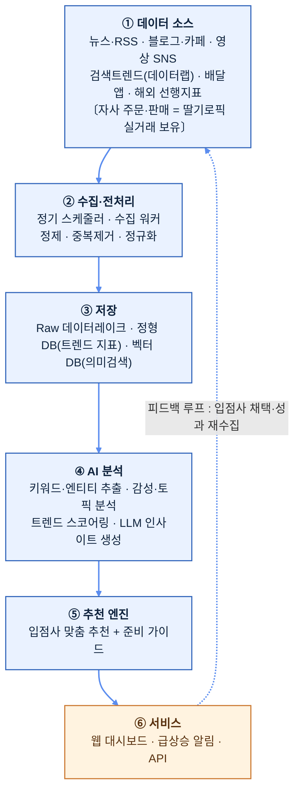

# 02. AI 기반 디저트 트렌드 분석·추천 시스템 (안건 1)

> **한 줄 요약**: 뉴스·블로그·SNS·검색·커머스 데이터를 정기 수집하고 AI로 분석하여, "곧 뜰 디저트 아이템"을 조기에 포착해 딸기로 입점 업체에게 맞춤 추천하는 SaaS형 웹 서비스.

---

## 1. 문제 정의 (Why)

디저트 시장은 **트렌드 수명이 짧고 변동이 극심**하다(예: 약과·두바이초콜릿·소금빵·크룽지 등이 수개월 단위로 부침). 입점 업체(소상공인 제조사)는:

- 트렌드를 **뒤늦게** 인지 → 유행 정점이 지난 뒤 진입 → 재고·설비 손실.
- 어떤 아이템이 **자기 업장 역량에 맞는지** 판단할 근거가 없음.
- 트렌드 정보가 흩어져 있고(뉴스·인스타·유튜브·배달앱), 수동 모니터링은 비현실적.

> 🎯 **구조적 문제 — 정보력 격차(본 과제의 출발점)**: 트렌드 분석·정보력은 전담 조직·데이터·예산을 갖춘 **대기업·대형 프랜차이즈에 쏠려 있다.** 자본·인력이 부족한 **소상공인·지방/청년 창업 디저트 업체**는 "무엇이 곧 뜨는지"를 알 길이 없어, 좋은 실력을 갖추고도 **디저트 강소업체로 자라나기 어렵다.** 이 정보 비대칭이 디저트 생태계의 다양성과 지역·청년 창업을 가로막는다 → 본 시스템은 **이 격차를 해소해 강소업체 성장 사다리를 놓는 것**을 미션으로 한다([00 미션](00_프로젝트개요.md), 사업화 [§10.3](#103-사업화--시장성)).

**딸기로의 기회**: 흩어진 **인터넷 공개 데이터(뉴스·블로그·SNS·검색·커머스)를 체계적으로 정기 취합·AI 분석**해, 개별 업체가 수동으로는 도저히 못 하는 속도·범위로 "다음에 뜰 것"을 조기 포착하면 — **대기업 수준의 정보력을 입점 소상공인에게 그대로 쥐여줄 수 있다.**
> **전제(2026-06-18 업데이트)**: 딸기로(딸기로픽, 동일 법인)는 **자사 실거래 데이터 + 픽미팀과의 정식 공동연구 산출물(트렌드 분석 대시보드 = 본 시스템의 선행 PoC, 방법론 4종 상세 [07](07_픽미공동연구_분석방법론.md))** 을 이미 보유한다 → **데이터 해자**. 특히 공동연구의 **시계열 분석 기법**([07 §1](07_픽미공동연구_분석방법론.md))은 본 시스템의 **고도화 출발점(선행 자체기법 v1)** 이다(백테스팅의 *단순 비교군*은 별도로 이동평균 임계 — §10.1). 본 시스템은 이 자사 데이터를 **인터넷 공개 데이터**(전국 비입점·신규 트렌드 보완축, 상세: [04_인터넷데이터_활용방법.md](04_인터넷데이터_활용방법.md))와 결합해 고도화한다. 추가로 서비스 운영의 **추천→채택→성과 피드백 데이터**가 해자를 강화하는 **선순환**을 목표로 한다.

## 2. 솔루션 개요 (What)

3계층 가치 제공:

| 계층 | 기능 | 사용자 가치 |
|------|------|-------------|
| **포착(Detect)** | 인터넷 전반 신호를 정기 수집·정규화 | 흩어진 정보를 한 곳에서 |
| **예측(Predict)** | AI가 트렌드 성장 곡선·수명·성공 가능성 스코어링 | "정점 전" 조기 진입 타이밍 |
| **추천(Recommend)** | 입점사 업종·역량·지역 맞춤 아이템 + 준비 가이드 | 실행 가능한 의사결정 |

산출 채널: **딸기로 자체 웹 대시보드 + 알림(급상승 아이템 푸시)**.

## 3. 시스템 아키텍처



핵심은 **흩어진 인터넷 신호를 한 파이프라인으로 통합**하는 점, 그리고 **피드백 루프**(추천→채택·성과 재수집)로 예측 정확도를 지속 개선하는 점이다. (딸기로픽 **자사 실거래 데이터를 이미 보유**해 결합하며, 운영 피드백으로 강화 — [04 §2](04_인터넷데이터_활용방법.md))

## 4. 데이터 수집 (Data Ingestion)

### 4.1 소스 분류

| 카테고리 | 소스 예시 | 신호 의미 | 수집 방식 |
|----------|-----------|-----------|-----------|
| 뉴스/언론 | 네이버 뉴스 API, 언론사 RSS, 구글 뉴스 | 업계·유행 공식화 신호 | API/RSS |
| 블로그/커뮤니티 | 네이버 블로그·카페, 디시·더쿠 | 초기 입소문 | API/크롤 |
| 영상 SNS | 유튜브, 틱톡, 인스타 릴스(해시태그) | 바이럴 폭발 선행지표 | API/공식 데이터 |
| 검색 수요 | 네이버 데이터랩, 구글 트렌드 | 실수요 정량화 | 공식 API |
| 커머스 | 배민·쿠팡이츠 인기메뉴, 오픈마켓 디저트 랭킹 | 실제 구매 전환 | 크롤 (자사 실거래·판매 데이터는 **보유** — 결합해 전환 검증에 활용) |
| 해외 선행 | 일본·유럽·미국 디저트 트렌드 매체 | K-디저트의 6～12개월 선행 신호 | RSS/번역 크롤 |

> ⚖️ **법적 주의**: 크롤링은 각 사이트 robots.txt·이용약관·저작권·개인정보를 준수. 가능하면 **공식 API 우선**, 불가 시 메타데이터/통계만 수집하고 원문 전재는 지양. TIPS 제안 시에도 "합법적 데이터 수집 거버넌스"를 명시하면 신뢰도 ↑.

### 4.2 정기 취합

- **스케줄링**: 소스별 주기 차등(뉴스 1일, SNS 6시간, 검색트렌드 1일). MVP는 cron/관리형 스케줄러, 확장 시 Airflow/Dagster.
- **정제**: 중복 제거, 디저트 도메인 외 노이즈 필터, 텍스트 정규화, 언어 감지/번역.

## 5. AI 분석 파이프라인 (핵심 R&D 영역)

수집 데이터에 대해 단계적으로 AI를 적용한다.

### 5.1 추출 (Extraction)

- **개체명 인식(NER)**: 텍스트에서 디저트명·재료·맛·브랜드·지역 추출. (디저트 도메인 특화 사전 + LLM 보정)
- **신규 엔티티 발견**: 사전에 없던 신조어/신메뉴 자동 탐지 → "초기 트렌드 후보"로 등록.

#### 5.1.1 신조어·신메뉴 자동 탐지 — 사전에 "없는 말"을 먼저 잡는 법 (차별화 메커니즘)

> **핵심 질문**: '크룽지'(크루아상+붕어빵), '두쫀쿠'처럼 *어느 날 갑자기 생긴 신메뉴·은어*를 시스템이 어떻게 알아채는가? 신조어는 트렌드의 **가장 이른 신호**라, 이걸 놓치면 조기 포착(§5.3.2) 자체가 시작될 수 없다. 이것이 안건 1 두 번째 기술 차별성이다.

**① 왜 일반 AI는 새 단어를 놓치는가.**
범용 NER·사전 기반 추출기는 **학습 시점에 존재하던 단어만** 인식한다. '크룽지'·'두쫀쿠'는 사전에 없으니 *그냥 무시(OOV, Out-Of-Vocabulary)* 되거나 엉뚱하게 쪼개진다. 즉 정의상 **"미래에 생길 단어"는 사전 방식으로는 잡을 수 없다.**

**② 그래서 사전이 아니라 "통계로 먼저, LLM으로 확인"한다.** — 세 단계의 자체 기법:

- **(a) 빈도 급증 기반 후보 자동 발굴** (사전 불필요): 어제까지 거의 안 쓰이던 토큰·n-gram(글자 조합)이 **갑자기 급증**하면 신조어 후보로 자동 등록한다. 사전을 안 보고 *증가율*만 보므로, 처음 보는 단어도 걸린다 — §5.3.2의 "절대량이 아니라 가속" 원리를 *단어 수준*에 그대로 적용한 것이다.
- **(b) LLM 보정·판별**(Claude): 후보를 LLM에 넘겨 ▸ *디저트 신메뉴/은어인가, 오타·무관어인가* 분류 ▸ **표기 흔들림 정규화**(크룽지/크룽쥐/크룽지빵 → 하나로) ▸ **구성 해석**('크룽지=크루아상+붕어빵'처럼 어원·합성 파악)을 한다. 통계가 *후보를 싸게 추리고*, LLM이 *정밀하게 판별*하는 역할 분담이다.
- **(c) 도메인 사전 자동 성장**: 확정된 신조어를 도메인 사전에 등록 → 다음부터 NER이 곧바로 인식한다. **쓸수록 사전이 스스로 자라는** 피드백 루프이며, 이 축적된 디저트 신조어 사전 자체가 모방하기 어려운 자산이다([07 §2 키워드 분석](07_픽미공동연구_분석방법론.md)의 선행 자산과 결합).

> **'두쫀쿠'·'크룽지'에 대입하면**: 출시 직후엔 어떤 사전에도 없지만, 블로그·SNS에서 *언급 빈도가 급증*하는 순간 (a)가 후보로 잡고 → (b) LLM이 "디저트 신메뉴"로 확정·정규화 → (c) 사전 등록과 동시에 **"초기 트렌드 후보"로 §5.3.2 조기 탐지 파이프라인에 투입**된다. 신조어가 *등장 1주 내* 추적 대상이 되는 것([§10.1 난제 2](#101-기술성--rd-도전-과제-심사-핵심) 포착 지연 ≤ 7일)이 이 흐름의 결과다.

**③ 이 로직도 주장이 아니라 선행 PoC가 있다.**
딸기로픽은 픽미 공동연구에서 **디저트 키워드 추출·집계·랭킹 파이프라인을 이미 코드로 구축·운영**했다([07 §2](07_픽미공동연구_분석방법론.md)). 본 과제는 여기에 *빈도 급증 후보 발굴 + LLM 판별·정규화*를 결합해 **신조어를 자동으로 잡아내는 단계로 고도화**한다. → [04 §4](04_인터넷데이터_활용방법.md) · [guides/07](guides/07_LLM_Claude_분류감성인사이트.md)

### 5.2 의미 분석 (Understanding)

- **감성 분석**: 언급의 긍/부정/중립 + 강도. (단순 빈도가 아니라 "호감도"를 반영)
- **토픽 모델링/임베딩 클러스터링**: 의미 유사 언급을 군집화해 "떠오르는 테마"(예: '저당 디저트', '레트로 간식') 도출.

### 5.3 트렌드 스코어링 (예측 — 차별화 핵심)

각 아이템에 대해 다단계 지표를 산출한다. 아래 5개 원리가 *"왜 우리 스코어링이 단순 모니터링과 다른가"* 의 본체이며, 각 원리의 **구체 메커니즘은 이어지는 §5.3.2～§5.3.5에서 심사역용으로 상술**한다.

| 원리 | 한 줄 요지 | 상세 |
|------|-----------|------|
| **모멘텀 스코어** | 언급량 증가율(1차·2차 미분) — 절대량보다 "가속도" 중시 | [§5.3.2](#532-조기-포착의-핵심-원리--절대량이-아니라-가속도를-본다-차별화-메커니즘) |
| **확산 단계 분류** | 태동기→성장기→정점→쇠퇴기(S-curve). **"성장기 진입 직후"=추천 타이밍** | [§5.3.2](#532-조기-포착의-핵심-원리--절대량이-아니라-가속도를-본다-차별화-메커니즘) |
| **수명 예측** | 과거 흥망 곡선과 시계열 유사도 매칭 → "얼마나 갈지" 추정 | [§5.3.4](#534-수명-예측--닮은-과거-곡선을-찾아-얼마나-갈지-맞히기-차별화-메커니즘) |
| **계절성·지역성 보정** | "원래 그맘때 오르는 것"과 진짜 신규 트렌드를 분리 | [§5.3.5](#535-계절성지역성-보정--원래-그맘때와-진짜-트렌드를-가르기-차별화-메커니즘) |
| **신뢰도(멀티소스 융합)** | 소스별 신뢰도 가중·조작 필터·교차검증 | [§5.3.3](#533-멀티소스-융합--신뢰도로-가중해-똑똑하게-합치기-차별화-메커니즘) |

### 5.3.1 점수 기준의 근거 — 딸기로픽 자체 트렌드 점수 공식 (공동연구 PoC v1)

> **자주 받는 질문**: "위 스코어링과 §10.1의 KPI 목표치는 무슨 기준으로 정했나? 딸기로픽만의 노하우·기준이 있나?"
> **답: 있다.** 추정으로 지어낸 수치가 아니라, 딸기로픽이 **픽미 공동연구로 이미 만들어 돌려본 '트렌드 점수' 대시보드(작동 PoC)** 의 산출 기준이 그 근거다([07 §1.1](07_픽미공동연구_분석방법론.md)). KPI는 이 PoC를 출발점(v1)으로 두고 *"얼마나 더 정확해지나(개선폭, §10.1)"* 로 잡는다.

**① 점수 = 여러 신호의 가중합** (단순 언급량 ❌) — "많이 언급됐다"가 아니라 **5개 신호를 가중 합산**해 점수를 낸다:

| 신호 | 가중치(PoC) | 쉽게 말하면 |
|------|------------|------------|
| 검색량 증가율 | 30% | 실제로 찾아보는 사람이 느나 |
| SNS 언급 증가 | 25% | 입소문이 퍼지나 |
| 감성(긍정도) | 20% | *좋게* 얘기되나(욕먹는 화제 제외) |
| 재구매 의향 | 15% | 한 번 먹고 마나, 또 사나 |
| 인구통계 적합 | 10% | 우리 타깃(예: 20대·여성)에 맞나 |

> 가중치는 화면/목적별로 미세조정(예: 검색 30·SNS 20·긍정 20·재구매 15·인구 10·기타 5). 정확 상수는 PoC 원본이 정본. *(예: PoC에서 '두바이 츄이쿠키' = 검색 +112%·SNS +90% → 종합 **80.7점**으로 1위)*

**② 시간창을 나눠 본다** (조기성 vs 지속성) — 같은 디저트도 **24시간(지금 뜨나)·7일·3개월(오래가나)** 을 따로 본다. *오늘 24h의 SNS·콘텐츠 신호*를 크게 봐서 **정점 전에 먼저** 잡는 게 핵심(→ §10.1 리드타임).

**③ 신호를 교차검증해 헛신호를 거른다** (딸기로픽 노하우) — 예: *"SNS는 터졌는데 재구매 의향이 낮다 → 기대 불일치, 반짝 유행 의심"* 처럼 신호가 어긋나면 경보를 띄운다. 이 교차검증이 **오탐(반짝 유행 오인) 통제**의 실제 근거다(→ §10.1 난제 3).

**④ 데이터 소스** — 네이버 데이터랩·구글 트렌드·유튜브·인스타그램·네이버 블로그/뉴스/카페·Google Places + **자사 실거래(딸기로픽)**.

**본 과제의 R&D(고도화)**: 위 **고정 가중합(v1)** → ⓐ S-curve·모멘텀·시계열 유사도로 *정점 전 성장기 진입* 자동 탐지(§5.3), ⓑ 운영 피드백(추천→채택→성과)으로 **가중치 자체를 학습**. 즉 KPI(§10.1)는 "v1 기준 대비 개선폭"이므로 *부풀린 절대치가 아니라 검증 가능한 향상*이다.

### 5.3.2 조기 포착의 핵심 원리 — "절대량"이 아니라 "가속도"를 본다 (차별화 메커니즘)

> **핵심 질문**: 두바이초콜릿이 *폭발적으로 유행하기 직전*의 "막 오르기 시작하는 신호"를 어떻게 **남보다 먼저** 잡아내는가? 이것이 안건 1의 기술 차별성의 본체이며, 단순 키워드 모니터링과 갈라지는 지점이다.

**① 언급량 총량을 보면 항상 늦는다 → 그래서 미분(증가율·가속)을 본다.**
"많이 언급됐다(절대량)"를 기준으로 삼으면, 그 수치가 커졌을 때는 이미 **정점이거나 정점 직전**이다 — 입점사가 재료를 발주하고 메뉴를 준비할 시간이 없다. 그래서 본 시스템은 절대량이 아니라 **변화의 속도와 그 가속**을 본다:

- **1차 미분(증가율)**: 최근 구간이 직전 구간보다 얼마나 빨리 늘고 있나 (`growth_rate`).
- **2차 미분(모멘텀)**: 그 증가율 자체가 *점점 더 빨라지고 있나* (`momentum`). — 폭발 직전 곡선의 고유한 특징이 바로 이 **가속**이다.

**② 확산 단계를 자동 분류해 "성장기 진입 직후"만 신호로 본다.**
두 미분값을 결합해 아이템을 **태동기 → 성장기 → 정점 → 쇠퇴기**로 분류하고, *가속이 막 붙기 시작한* **성장기 진입 직후**를 추천 타이밍으로 정의한다([guides/09 §3·§4](guides/09_트렌드스코어링_백테스팅.md)에 작동 코드):

```python
def stage(series):                       # series: 시계열(오래된→최신)
    g, m = growth_rate(series), momentum(series)
    if g <= 0.05:           return "태동기"   # 아직 잠잠 — 신호 보류
    if g > 0.05 and m > 0:  return "성장기"   # ← 추천! 증가율이 '가속 중'
    if g > 0.3 and m <= 0:  return "정점"     # 가속 둔화 = 이미 늦음
    return "쇠퇴기"
```

> **두바이초콜릿에 대입하면**: 언급 절대량이 아직 작아 *눈으로는 잠잠해 보이는 시점*에도, 증가율이 임계를 넘고 그 증가율이 **계속 빨라지면**(`momentum > 0`) 시스템은 "성장기 진입"으로 판정해 **정점 도달 전에** 입점사에 신호를 보낸다. 이것이 "언론 보도 대비 리드타임 ≥ 14일"([§10.1](#101-기술성--rd-도전-과제-심사-핵심))의 메커니즘적 근거다.

**③ 시간창을 분리해 "지금 뜨나"와 "오래가나"를 동시에 판정한다.**
같은 아이템을 **24시간(조기성)·7일·3개월(지속성)** 세 창으로 나눠 본다. 오늘 24h의 SNS·콘텐츠 가속을 크게 봐서 *먼저 잡되*, 3개월 창으로 *반짝 유행과 지속 트렌드를 가린다*. 나아가 **다신호 교차검증**(예: "SNS는 터졌는데 재구매 의향은 낮다 → 반짝 유행 의심" 경보, [§5.3.1 ③](#531-점수-기준의-근거--딸기로픽-자체-트렌드-점수-공식-공동연구-poc-v1))으로 헛신호를 구조적으로 거른다.

**④ 이 로직은 주장이 아니라 이미 구현·작동한다.**
위 단계분류·가중합은 **실행 가능한 코드로 존재**([guides/09](guides/09_트렌드스코어링_백테스팅.md))하며, 그 출발점인 가중합 점수 모델은 딸기로픽이 **픽미 공동연구에서 이미 만들어 돌려본 작동 PoC**다([§5.3.1](#531-점수-기준의-근거--딸기로픽-자체-트렌드-점수-공식-공동연구-poc-v1), [07 §1](07_픽미공동연구_분석방법론.md)). 본 과제는 이 v1을 **S-curve(로지스틱) 곡선 피팅으로 변곡점 정밀 포착 + 과거 흥망 곡선과의 시계열 유사도 매칭으로 수명 예측 + 운영 피드백 기반 가중치 자동 학습**으로 고도화한다(§5.3·§10.1 표 #1). 즉 *"새로 시작하는 아이디어"가 아니라 "작동하는 자체 기법을 연구로 끌어올리는 R&D"* 다.

> **심사 포지셔닝 한 줄**: LLM은 결과를 *설명*하는 부품이고, "정점 전에 먼저 잡는" 판단은 **우리 고유의 미분 기반 단계분류 + 시계열 유사도 + 학습형 가중치**가 한다 — *계산은 코드, 생성은 LLM*의 책임 분리(§5.4·§5.5)가 그대로 차별성이자 검증가능성의 근거다.

### 5.3.3 멀티소스 융합 — 신뢰도로 가중해 "똑똑하게" 합치기 (차별화 메커니즘)

> **핵심 질문**: 트렌드 신호는 블로그·유튜브·검색량·SNS 등 *여러 곳에 흩어져 있고 각자 광고·조작에 오염*돼 있다. 이걸 어떻게 합쳐야 노이즈가 아니라 *더 정확한 한 점수*가 되는가? 이것이 안건 1 세 번째 기술 차별성이다.

**① 그냥 다 더하면 오히려 나빠진다.**
소스를 단순 합산하면 두 가지가 깨진다 — ▸ **신뢰도 차이 무시**: 실제 구매로 이어지는 *검색량*과, 조작이 쉬운 *SNS 좋아요*를 같은 무게로 더하면 약한 신호가 강한 신호를 희석한다. ▸ **조작 1건이 전체를 흔든다**: 한 소스에 광고·봇 도배가 끼면, 단순 합산은 그 오염을 그대로 점수에 반영한다. 즉 **"많은 소스 = 좋음"이 아니라, 잘못 합치면 노이즈만 커진다.**

**② 그래서 신뢰도로 가중하고, 오염을 걸러내고, 서로 교차검증한다.** — 세 축의 자체 기법:

- **(a) 소스 신뢰도 가중**: 소스마다 신뢰도 가중치를 다르게 둔다(예: 실수요를 반영하는 검색량 > 확산은 빠르나 조작이 쉬운 SNS). 이 가중치는 고정이 아니라 **과거 적중 이력으로 보정·학습**한다(어떤 소스가 실제로 잘 맞혔나).
- **(b) 이상치·조작 필터**: *짧은 시간 동일 문구 도배·봇 패턴·광고 표지* 같은 비정상 급증을 탐지해 **제외하거나 감점**한다. 광고성 반짝 급등에 속지 않게 하는 1차 방어선이다.
- **(c) 교차검증 기반 신뢰도 보정**: **여러 소스가 서로 독립적으로 같은 신호를 낼 때** 신뢰도를 올리고, 한 소스만 튀면 의심한다(§5.3.1 ③ 다신호 교차검증과 동일 원리). "검색량·SNS·재구매가 함께 오르면 진짜, SNS만 터지면 보류"가 그 예다.

> **왜 KPI를 "단일 최량 소스 대비 +15%p"로 빡빡하게 잡았나**([§10.1 난제 3](#101-기술성--rd-도전-과제-심사-핵심)): 비교 상대를 *여러 소스 평균*이 아니라 **그중 가장 잘 맞히는 단일 소스 하나**로 잡았다. "여러 개 합치면 좋다"는 주장은 *제일 좋은 하나를 못 이기면 의미가 없기* 때문 — 즉 **합치는 수고가 실제로 이득을 낸다는 걸 증명**하는 정직한 장치다.

**③ 이 로직도 주장이 아니라 선행 자산이 있다.**
딸기로픽은 픽미 공동연구에서 **검색·SNS·감성·재구매·인구통계 등 다소스를 가중 합산한 트렌드 점수 대시보드를 이미 운영**했고([07 §1.1](07_픽미공동연구_분석방법론.md)·[§5.3.1](#531-점수-기준의-근거--딸기로픽-자체-트렌드-점수-공식-공동연구-poc-v1)), **다신호 결합 인기도 산출**은 특허로도 출원돼 있다([10-2025-0060352](08_특허출원_지식재산.md)). 본 과제는 이 고정 가중합을 **신뢰도 학습 + 조작 필터**로 고도화한다.

### 5.3.4 수명 예측 — "닮은 과거 곡선"을 찾아 얼마나 갈지 맞히기 (차별화 메커니즘)

> **핵심 질문**: 성장기 진입을 잡았다 해도, 이게 *탕후루처럼 반짝하고 끝날지* 아니면 *소금빵처럼 오래 갈지* 를 모르면 입점사는 발주량·재고를 못 정한다. "곧 뜬다"만큼 중요한 것이 **"얼마나 갈까"** 다.

**① 성장 신호만으로는 절반이다.**
같은 "성장기"라도 수명이 다르면 대응이 정반대다 — *급등급락형*(탕후루·약과)은 짧게 치고 빠져야 하고, *지속형*(소금빵·베이글)은 메뉴로 안착시켜야 한다. 수명을 모른 채 발주하면 **재고 폐기(과잉)** 나 **품절 기회손실(과소)** 로 직결된다.

**② 그래서 "지금 곡선이 과거 어떤 흥망과 닮았는지"를 찾는다.** — 시계열 유사도 매칭:

- **(a) 과거 흥망 곡선 라이브러리**: 이미 흥하고 진 디저트들의 검색·언급 곡선(부상→정점→쇠퇴 전체)을 **정점월·반감기 라벨과 함께 DB화**한다(탕후루 '23-08·반감 54일, 약과, 소금빵=지속형 반례 등 — [guides/09 §5.0](guides/09_트렌드스코어링_백테스팅.md)).
- **(b) 곡선 모양 매칭**: 현재 아이템의 *지금까지 그려진 곡선 모양*을, 절대 크기가 아니라 **모양(상승 기울기·가속 패턴)** 기준으로 과거 곡선들과 시계열 유사도로 비교한다. 가장 닮은 과거 사례군의 **잔존 기간·정점 높이**를 잔존 수명 추정의 근거로 삼는다.
- **(c) 지속형 vs 급등급락형 판정**: 닮은 꼴이 급등급락 군집이면 "짧게", 지속 군집이면 "길게" 라벨을 붙여 추천 메시지(발주 강도·시점)를 차등한다.

> **두바이초콜릿에 대입하면**: 초기 상승 곡선이 *탕후루(급등급락)* 형태와 닮았으면 "단기 한정 메뉴로 빠르게", *소금빵(지속)* 과 닮았으면 "상시 메뉴로 안착" 으로 입점사에 다른 전략을 준다. 성장기 탐지(§5.3.2)가 *언제* 라면, 수명 예측은 *얼마나* 를 답한다.

**③ 이 로직도 주장이 아니라 선행 자산이 있다.**
픽미 공동연구의 **디저트 트렌드 시계열 분석**([07 §1](07_픽미공동연구_분석방법론.md))이 곡선 패턴 식별의 출발점이고, 백테스팅 검증셋(정점월 라벨 7종, [guides/09 §5.0](guides/09_트렌드스코어링_백테스팅.md))이 곧 **유사도 매칭 라이브러리의 시드 데이터**다. 본 과제는 이를 곡선 유사도 기반 수명 예측으로 고도화한다.

### 5.3.5 계절성·지역성 보정 — "원래 그맘때"와 진짜 트렌드를 가르기 (차별화 메커니즘)

> **핵심 질문**: 겨울에 붕어빵 검색이 느는 건 *새 트렌드*가 아니라 **"원래 매년 그맘때 오르는 것"** 이다. 이 계절·지역 효과를 진짜 신규 트렌드와 구분하지 못하면, 매년 반복되는 패턴을 "곧 뜰 아이템"으로 잘못 외친다.

**① 보정하지 않으면 가짜 신호가 쏟아진다.**
▸ **계절 착시**: 빙수(여름)·붕어빵(겨울)처럼 *주기적으로 반복되는 상승*을 신규 급등으로 오인하면 오탐이 급증한다. ▸ **지역 착시**: 특정 지역에서만 뜨는 국지 현상을 *전국 트렌드*로 착각하면, 그게 안 통하는 지역 입점사에 헛다리 추천을 준다.

**② 그래서 "계절 기준선"을 빼고, "지역에서 전국으로 번지는지"를 본다.** — 두 축의 보정:

- **(a) 계절성 분해**: 과거 **동월·동기 대비(YoY)** 로 계절 기준선(baseline)을 만들고, 그걸 차감한 **"계절 보정 후 순증"** 만 트렌드 신호로 본다. 매년 반복되는 부분은 0에 가깝게 상쇄돼, *예년보다 유난히 더 오른 것* 만 남는다.
- **(b) 지역성 추적**: 지역별로 신호를 따로 산출하고, **한 지역 → 인접·전국으로 확산되는 패턴**인지(진짜 트렌드) 아니면 *특정 지역에 머무는지*(국지)인지 구분한다. 확산 중인 것은 가중↑, 국지는 해당 지역 입점사에만 매칭한다.

> **대입하면**: *겨울 붕어빵* 급증은 계절 기준선을 빼면 순증이 미미 → **신호 안 냄**(오탐 회피). 반면 같은 겨울의 *두바이초콜릿* 급증은 비교할 계절 기준선이 없는 신규 항목이라 순증이 그대로 남아 → **신호 발생**. 또 서울 성수에서 시작해 전국으로 번지는 신호는 전국 트렌드로, 한 동네에만 머무는 신호는 국지로 분리한다.

**③ 이 로직도 주장이 아니라 선행 자산이 있다.**
픽미 공동연구 시계열 분석이 **계절 주기·지역별 추이 식별을 이미 포함**([07 §1](07_픽미공동연구_분석방법론.md))하며, 자사 실거래 데이터의 지역·기간 분포가 보정의 기준선을 정밀화한다. 본 과제는 이를 *계절 분해 + 지역 확산 추적* 으로 고도화해 오탐률(§10.1 난제 1)을 구조적으로 낮춘다.

### 5.4 LLM 인사이트 생성 (Claude 활용)

- 정량 지표 + 원천 근거를 **Claude API**에 입력 → 사람이 읽을 **"왜 뜨는가 / 누가 만들면 좋은가 / 어떻게 준비하나"** 자연어 브리핑 자동 생성.
- **근거 추적(citation)**: 인사이트마다 출처 링크를 첨부해 신뢰성과 검증가능성 확보.
- 환각 방지: 정량 지표는 코드로 계산하고 LLM은 **설명·요약·추천 문장 생성**에 한정(계산을 LLM에 맡기지 않음).

> 모델 운영: 대량 분류·요약은 저비용 모델(Haiku), 심층 인사이트·전략 브리핑은 고성능 모델(Sonnet/Opus)로 **티어링**해 비용 최적화. (정확 수치는 `claude-api` 스킬로 확인 후 비용표에 반영)

#### 5.4.1 AI가 숫자를 지어내지 못하게 — 환각 통제 메커니즘 (차별화·신뢰성)

> **핵심 질문**: "이번 주 ○○이 검색량 3배 늘었습니다" 같은 트렌드 브리핑을 AI가 자동으로 써 주면 편하다. 그런데 *LLM은 모르는 숫자를 그럴듯하게 지어내는 버릇(환각)* 이 있다 — **틀린 수치 한 줄이 입점사의 발주·메뉴 결정을 망친다.** 그래서 "AI가 썼지만 믿을 수 있다"를 어떻게 *구조적으로* 보장하는가가 안건 1 네 번째 기술 차별성이다.

**① 왜 위험한가.**
LLM에게 "이번 주 트렌드 정리해줘"라고 통째로 맡기면, 근거에 없는 배수·퍼센트·순위를 *말투만 자신 있게* 만들어 낸다. 트렌드 브리핑은 숫자가 곧 의사결정 근거라, 환각 수치는 단순 오타가 아니라 **사업적 손실**로 이어진다.

**② 그래서 "계산은 코드, 말은 AI"로 일을 쪼개고, 근거에 결박한다.** — 세 축의 자체 기법:

- **(a) 계산–생성 책임 분리**: 검색량·증가율·점수 같은 **모든 수치는 코드가 정확히 계산**하고, LLM은 *그 확정된 숫자를 자연스러운 문장으로 옮기는 역할만* 한다. LLM이 수치를 *만들어 낼 여지 자체를 제거*한다(§5.5 "수치 계산은 그래프 밖 코드").
- **(b) RAG 근거 결박**: 인사이트 생성 시 **코드가 낸 정량 지표 + 원천 글(근거)만 검색해 주입**하고, *"주어진 근거 밖의 수치·사실은 쓰지 말 것"* 을 프롬프트로 강제한다(§5.5). 모델이 참고할 수 있는 자료를 *우리가 통제한 근거*로 한정하는 것이다.
- **(c) 출처 강제(citation)**: 모든 문장·주장에 **"이 숫자는 어디서 나왔다"는 출처를 반드시 붙이게** 한다. 출처를 댈 수 없는 주장은 출력에서 막힌다.

> **그래서 KPI가 "주장"이 아니라 "구조적 보장"이다**([§10.1 난제 4](#101-기술성--rd-도전-과제-심사-핵심)): 수치를 코드가 계산하니 **사실 오류율 ≤ 1%**, 모든 주장에 출처가 강제되니 **출처 추적률 100%** 가 *설계상* 따라온다. 심사에서 "이 수치 근거가 어디냐"를 물으면 **그 자리에서 출처로 즉답**할 수 있다 — 검증 가능성이 곧 R&D의 신뢰성 증거다.

**③ 안건 1만의 장치가 아니다.**
이 *계산–생성 분리 + RAG + citation* 원칙은 안건 2의 추천 근거 생성에도 동일하게 적용된다([03 §10.1.1 난제 5](03_자연어추천랭킹시스템_기획.md)). 즉 환각 통제는 두 안건을 관통하는 **공통 신뢰성 설계**이며, 오케스트레이션 골격(LangChain·LangGraph·RAG)이 이를 단계별로 측정·강제한다(§5.5).

### 5.5 파이프라인 오케스트레이션 & RAG (LangChain · LangGraph · 검색증강생성)

위 5단계(추출→이해→스코어링→인사이트)는 "LLM 한 번 호출"이 아니라 **단계별 재시도·부분실패 격리·관측이 가능한 그래프**로 구성한다. 이를 위해 LangChain(호출·구조화 출력·검색기 표준화)·LangGraph(상태 그래프)·**RAG(검색증강생성)** 를 골격으로 쓴다. (실습 코드: [guides/10](guides/10_LangChain_LangGraph_RAG.md))

- **LangChain — 구조화 출력**: NER/신조어·감성 결과를 스키마로 강제(`with_structured_output`)해 파싱 오류 제거(§5.1·5.2, 난제 2).
- **LangGraph — 분석 그래프**: `추출 → 감성 → 스코어(코드) → 인사이트` 를 노드로 분리. 노드 단위 재시도·로깅으로 KPI(환각 오류율 등)를 **단계별로 측정**해 §10.1 검증에 연결.
- **RAG — 환각 통제형 인사이트(§5.4, 난제 4)**: 인사이트 생성은 **코드가 계산한 정량 지표 + 원천 글(근거)만 검색해 주입**하고, "근거 밖 수치는 지어내지 말 것 + 문장마다 출처" 를 프롬프트로 강제. 이 구조가 KPI(**사실 오류율 ≤ 1%, 출처 추적률 100%**, §10.1)의 *구조적* 근거다.
- **포지셔닝**: 프레임워크는 플러밍을 표준화해 팀이 *재발명 대신 차별화 R&D*(스코어링·융합 가중·환각 통제)에 집중하게 하는 골격일 뿐 — 차별성은 그 위에 얹는 도메인 로직이다(§10.2). **스코어링 등 수치 계산은 그래프 밖 코드**로 유지(계산-생성 책임 분리).

## 6. 추천 엔진

입점사별 맞춤 추천. 입력: ① 트렌드 스코어 ② 입점사 프로필(업종·생산설비·가격대·지역·과거 판매).

- **적합도 매칭**: "뜨는 아이템" 중 해당 업장이 **실제로 만들 수 있고 수익 날** 것만 우선순위화.
- **준비 가이드 동봉**: 예상 원가/마진, 레시피 난이도, 필요 설비, 권장 진입 시점, 예상 트렌드 잔존 기간.
- **조기 경보 알림**: 급상승 신호 감지 시 적합 입점사에게 푸시(웹/이메일/카카오).
- **개인화 고도화(확장)**: 입점사 채택·판매 성과를 학습해 추천 정확도 개선(피드백 루프).

## 7. 웹 플랫폼 (입점사 대면)

- **트렌드 대시보드**: 실시간 랭킹, 상승/하락 무버, 카테고리별 히트맵.
- **아이템 상세**: 성장 곡선, 확산 단계, 근거 데이터·출처, 예측 수명, AI 브리핑.
- **나의 추천**: 입점사 맞춤 Top-N + 준비 가이드.
- **알림 센터**: 급상승 조기 경보.
- **관리자**: 데이터 소스·수집 상태·모델 품질 모니터링.

## 8. 기술 스택 (제안 예시)

| 영역 | MVP 권장 | 확장 |
|------|----------|------|
| 수집/스케줄 | Python + cron/관리형 스케줄러 | Airflow/Dagster, 메시지 큐 |
| 저장 | PostgreSQL + 객체 스토리지 | + 벡터 DB(pgvector→전용), 데이터웨어하우스 |
| AI/LLM | Claude API(Haiku/Sonnet 티어링), 오픈소스 임베딩 | 도메인 파인튜닝/자체 스코어링 모델 |
| 오케스트레이션 | LangChain(호출·구조화 출력) + LangGraph(분석 그래프) + RAG(근거기반 인사이트) — [guides/10](guides/10_LangChain_LangGraph_RAG.md) | 노드 단위 관측·평가 자동화 |
| 백엔드 | FastAPI/Node | 마이크로서비스 |
| 프론트 | Next.js + 차트 라이브러리 | — |
| 인프라 | 단일 클라우드(관리형) | 컨테이너 오케스트레이션, IaC |

> 스택은 딸기로 기존 기술 자산에 맞춰 조정 (현재 개발 환경 확인 필요 — PROGRESS.md 미해결 항목).

## 9. 단계적 로드맵 (MVP → 확장)

### Phase 0 — 검증 PoC (1～2개월)

- 소스 2～3종(네이버 뉴스+데이터랩+1 SNS)만 수집, 수동 분석 병행.
- Claude API로 주간 트렌드 브리핑 자동 생성 → 소수 입점사에 수동 전달.
- **목표**: "AI 브리핑이 실제로 유용한가" 가설 검증. (낮은 비용/인력)

### Phase 1 — MVP 웹 서비스 (3～5개월)

- 자동 수집 파이프라인 + 트렌드 스코어링 v1 + 웹 대시보드 + 알림.
- 자사 주문 데이터 연동 시작. 일부 입점사 베타.

### Phase 2 — 추천 개인화 & 정확도 (6～9개월)

- 입점사 프로필 기반 맞춤 추천, 피드백 루프 구축, 예측 정확도 KPI 측정.

### Phase 3 — 고도화 & 확장 (10개월～)

- 도메인 특화 모델/파인튜닝, 해외 선행지표, 외부 SaaS 판매 가능성 검토.

## 10. TIPS 포지셔닝 (제안서 논리)

### 10.1 기술성 / R&D 도전 과제 (심사 핵심)

> **포지셔닝**: 본 과제는 "LLM API를 호출하는 서비스 개발"이 아니라, **LLM을 부품으로 쓰되 트렌드 예측·융합·검증의 정확도를 연구로 끌어올리는 R&D**다. 아래 4대 난제는 **단순 프롬프팅/임계값으로는 목표 정확도가 안 나오는** 문제이며, 각각 베이스라인 대비 정량 목표와 자체 기법을 둔다.

| # | R&D 난제 (왜 연구인가) | 베이스라인 한계 | 정량 목표(KPI)¹ | 자체 기법 |
|---|------------------------|-----------------|-----------------|-----------|
| 1 | **트렌드 조기 예측** — 노이즈·광고 섞인 멀티소스에서 "정점 전 성장기 진입" 식별 | 단순 언급량 임계·이동평균은 광고성 급등에 속고 정점을 **후행** 포착 | 성장기 진입 탐지 **정밀도·재현율 ≥ 0.7**, 언론 보도 대비 **리드타임 ≥ 14일**, 반짝유행 **오탐 ≤ 20%** | S-curve 피팅 + 1·2차 미분 모멘텀 + 과거 곡선 시계열 유사도 매칭 |
| 2 | **도메인 NER/신조어 탐지** — 디저트 신메뉴·은어 실시간 발견 | 범용 NER은 신조어·합성어(예: '크룽지')를 **누락** | 신조어 신규 탐지 **F1 ≥ 0.8**, 평균 포착 지연 **≤ 7일** | 도메인 사전 + LLM 보정 + 빈도 급증 기반 후보 자동 발굴 |
| 3 | **멀티소스 융합 스코어링** — 텍스트·영상·검색·(향후)거래를 한 점수로 | 단일 소스/단순 합산은 소스 신뢰도·광고 편향 **미반영** | 융합 스코어가 **단일 최량 소스 대비 적중률 +15%p** | 소스 신뢰도 가중 + 이상치(광고·조작) 필터 + 신뢰도 보정 |
| 4 | **LLM 환각 통제형 인사이트** — 근거 있는 브리핑 자동 생성 | LLM 단독 생성은 수치를 **지어냄(환각)** | 인사이트 내 수치·사실 **오류율 ≤ 1%**, 주장 **출처 추적률 100%** | **RAG**(근거만 검색·주입) + 계산=코드/생성=LLM 책임 분리 + citation 강제([§5.5](#55-파이프라인-오케스트레이션--rag-langchain--langgraph--검색증강생성)) |

¹ **목표치는 제안 단계 가정**이며, **콜드스타트 백테스팅**(이미 흥망이 끝난 약과·두바이초콜릿·소금빵 등 과거 데이터로 사전 검증 — [04 §2](04_인터넷데이터_활용방법.md), [guides/09](guides/09_트렌드스코어링_백테스팅.md))으로 1차 측정하고, 파일럿 운영 데이터로 캘리브레이션한다. → **"정확도 자체가 R&D 산출물"**. 평가 '개발 실현성' 항목 대응으로 **검증 환경·방법을 구체화하고 가능하면 제3자 공인**으로 객관성을 더한다([01 §3](01_TIPS제안서_갭분석및체크리스트.md)). **점수 산정 기준·가중치의 노하우와 근거**(딸기로픽 자체 트렌드 점수 공식·작동 PoC v1)는 **[§5.3.1](#531-점수-기준의-근거--딸기로픽-자체-트렌드-점수-공식-공동연구-poc-v1)** 참조 — 목표치는 이 v1 대비 *개선폭*이다.

#### 10.1.1 KPI 읽는 법 — 각 목표치의 근거와 수준 (심사역용 해설)

> 위 표의 숫자가 **어디서 나왔고(근거)**, **왜 그 값이 합격선인지(기준점)**, **베이스라인 대비 어느 수준까지 끌어올리는지(개선폭)**를 비전문가도 읽을 수 있게 풀어 쓴 것이다. 핵심은 "절대값"이 아니라 **동일 검증셋에서 단순 베이스라인과 나란히 측정한 개선폭**(백테스팅, §10.1)이다.
>
> **읽기 전에, 자주 나오는 용어 3개만** (낚시 비유로 한 번에):
>
> - **정밀도** = "성장한다고 *고른* 것 중 진짜 뜬 비율" → *건진 것 중 생선 비율*(헛다리 안 짚기).
> - **재현율** = "실제로 뜬 것 중 미리 잡아낸 비율" → *강에 있던 생선 중 건진 비율*(놓치지 않기).
> - **F1** = 위 둘을 **함께 보는 종합 점수**(한쪽만 잘해선 안 됨). 0～1 사이이고 **시험 점수처럼 1.0이 만점**(0.8 ≈ 80점).
>
> ⚠️ **왜 합격선이 0.7～0.8로, 안건 2(0.85～0.95)보다 낮은가**: 안건 2는 *이미 있는* 가게·조건을 *알아맞히는* 일이지만, 안건 1은 **아직 안 일어난 미래(어떤 디저트가 곧 뜰지)를 미리 맞히는** 일이다. 일기예보가 "어제 비 왔다"보다 "내일 비 온다"가 훨씬 어려운 것과 같다. 그래서 합격선이 낮은 건 **기술이 부족해서가 아니라 "예측은 원래 더 어렵다"는 현실을 반영한 정직한 목표**다.

**난제 1 — 뜨기 *전에* 미리 알아채기 · `정밀도·재현율 ≥ 0.7`, `리드타임 ≥ 14일`, `오탐 ≤ 20%`**

- **무슨 문제냐면**: 어떤 디저트(예: 두바이초콜릿)가 **폭발적으로 유행하기 직전의 "막 오르기 시작하는 신호"를 남보다 먼저 잡아내는** 일이다. 이미 뉴스에 나온 뒤엔 늦다 — 입점사가 재료 발주하고 메뉴 준비할 시간이 없다. **어떻게 먼저 잡는지(미분 기반 단계분류 메커니즘)는 [§5.3.2](#532-조기-포착의-핵심-원리--절대량이-아니라-가속도를-본다-차별화-메커니즘) 참조.**
- **0.7점은 어느 정도냐면**: "곧 뜬다"는 판정의 정확성(정밀도·재현율)이 70점이라는 뜻. 미래 예측이라 100점은 불가능에 가깝고, **70점이면 "사람이 눈으로 지켜보는 것보다 분명히 낫고, 발주 결정에 실제로 쓸 만한"** 수준이다. 옛 방식(언급량이 갑자기 늘면 유행으로 판정)은 **광고성 반짝 급등에 잘 속고, 정점을 한참 지나서야 뒤늦게** 알아챈다.
- **리드타임 14일이란**: **언론 보도(= 누구나 아는 시점)보다 2주 먼저** 신호를 준다는 뜻. 이 2주가 메뉴 기획·발주에 필요한 최소 시간이고, *"남보다 먼저"* 가 곧 돈이 되는 지점이다.
- **오탐 ≤ 20%란**: *반짝하고 마는 유행*을 "곧 대박"이라고 잘못 외치는 일이 **5번 중 1번 이하**. 헛신호가 잦으면 입점사가 신뢰를 잃으므로 상한을 둔다. → **실측값은 아래 〈백테스팅 결과 기록표〉에 옛 방식과 나란히 채워** 얼마나 더 나은지를 증거로 남긴다.

**난제 2 — 사전에 없는 새 단어 잡아내기 · 신조어 `F1 ≥ 0.8`, `포착 지연 ≤ 7일`**

- **무슨 문제냐면**: '크룽지'(크루아상+붕어빵), '두쫀쿠'처럼 **어느 날 갑자기 생긴 신메뉴·은어**를 시스템이 알아채야 트렌드를 추적한다. 그런데 일반 AI는 **배운 적 없는 새 단어를 그냥 무시**한다(사전에 없으니까). **사전 없이 어떻게 잡는지(빈도 급증 후보 발굴 + LLM 판별·정규화)는 [§5.1.1](#511-신조어신메뉴-자동-탐지--사전에-없는-말을-먼저-잡는-법-차별화-메커니즘) 참조.**
- **0.8점이란**: 새로 생긴 단어 10개 중 **8개를 빠짐없이·정확히 잡아낸다**는 뜻. 신조어는 등장 초기에 표기(크룽지/크룽쥐)와 의미가 흔들려서, 일반 단어 합격선(0.85)보다 살짝 낮은 0.8을 **현실적 목표**로 잡았다. 도메인 사전 + AI 보정 + "갑자기 많이 쓰이는 말 자동 후보 발굴"로 끌어올린다.
- **포착 지연 7일이란**: 단어가 처음 퍼지고 **늦어도 1주 안에 시스템이 인지**. 트렌드는 초기 1～2주가 생명이라, 7일이 *"남보다 먼저 알아챈다"* 의 실효 마지노선이다.

**난제 3 — 여러 출처를 똑똑하게 합치기 · 융합 `단일 최량 소스 대비 +15%p`**

- **무슨 문제냐면**: 트렌드 신호는 블로그·유튜브·검색량 등 **여러 곳에 흩어져 있고, 각자 광고·조작에 오염**돼 있다. 이걸 그냥 다 더하면 오히려 노이즈가 커진다. **출처마다 신뢰도를 다르게 매겨 똑똑하게 합쳐야** 한다. **어떻게 합치는지(신뢰도 가중 + 조작 필터 + 교차검증)는 [§5.3.3](#533-멀티소스-융합--신뢰도로-가중해-똑똑하게-합치기-차별화-메커니즘) 참조.**
- **"+15%p"란**: 여러 출처를 신뢰도로 가중해 합친 점수가, **그중 가장 좋은 출처 하나만 썼을 때보다 적중률이 15%포인트 더 높다**는 목표. 여기서 비교 상대를 일부러 *가장 센 단일 출처*로 빡빡하게 잡은 이유는 — *"여러 개 합치면 좋다"는 주장은, 제일 좋은 하나를 못 이기면 의미가 없기* 때문이다. 즉 **합치는 수고가 실제로 이득을 낸다는 걸 증명**하는 장치다.
- **참고**: '%p(퍼센트포인트)'는 *상대 비율 %*가 아니라 **절대 격차**다(예: 60% → 75%면 +15%p). 부풀리기 어려운 정직한 표현이다.

**난제 4 — AI가 숫자를 지어내지 못하게 · 사실 `오류율 ≤ 1%`, `출처 추적률 100%`**

- **무슨 문제냐면**: "이번 주 ○○이 검색량 3배 늘었습니다" 같은 **트렌드 브리핑을 AI가 자동으로 써 주면** 편한데, **AI(LLM)는 모르는 숫자를 그럴듯하게 지어내는 버릇**(환각)이 있다. 틀린 수치로 보고하면 의사결정을 망친다. **어떻게 막는지(계산–생성 분리 + RAG 근거 결박 + 출처 강제)는 [§5.4.1](#541-ai가-숫자를-지어내지-못하게--환각-통제-메커니즘-차별화신뢰성) 참조.**
- **어떻게 막냐면**: **숫자·계산은 코드가 정확히 뽑고, AI는 그 숫자를 자연스러운 문장으로 옮기는 역할만** 하도록 일을 나눈다. AI가 수치를 만들어 낼 여지 자체를 없애므로 사실 오류율 ≤ 1%. 또 모든 주장에 **"이 숫자는 어디서 나왔다"는 출처를 붙이게**(citation) 강제하니 **출처 추적률 100%는 구조적으로 보장**된다 — 심사 때 "이 수치 근거 어디냐"에 즉답하는 검증 장치다. (안건 2도 같은 원칙 — [03 §10.1.1 난제 5](03_자연어추천랭킹시스템_기획.md).)

**백테스팅 설계(요지)** — 위 KPI를 *제안 단계에서* 1차 실측하는 최소 절차. **자사 데이터 없이 인터넷 공개 과거데이터만으로** 가능하며, 코드는 [guides/09 §5](guides/09_트렌드스코어링_백테스팅.md)의 `stage()`·`first_growth_signal()`·`lead_time()`과 연결된다. 이 결과가 곧 [01 §7](01_TIPS제안서_갭분석및체크리스트.md) **트랙션 증거 1건**이다.

1. **검증셋**: 흥망 시점이 보도로 확인되는 과거 아이템(탕후루 '23-08·두바이초콜릿 '24-07·요아정 '24-08·약과 '23·베이글·소금빵·두쫀쿠 '26-01 등) — **실제 정점월을 라벨로 고정**. 급등급락형+지속형(소금빵=반례)+최신(두쫀쿠)을 섞는다. **라벨표 → [guides/09 §5.0](guides/09_트렌드스코어링_백테스팅.md)**.
2. **데이터**: 각 아이템의 네이버 데이터랩 검색추이 + (가능 시) 뉴스·블로그 언급량을 과거 1～2년 일/주 단위로 수집(자사 데이터 불필요 — [04 §2](04_인터넷데이터_활용방법.md)).
3. **시뮬레이션**: 날짜를 하루씩 진행하며 *그날까지의 데이터만으로* `stage()`가 처음 "성장기"로 판정한 날을 기록(**미래 정보 누설 차단**이 핵심).
4. **평가**: 실제 정점일 대비 **리드타임 = 정점일 − 신호일(≥14일 목표)**, 성장기 판정 아이템의 **적중률**, 헛신호 **오탐률(≤20%)** 을 베이스라인(단순 언급량 7일 이동평균 임계)과 비교.
5. **튜닝·재현**: 가중치·임계값을 교차검증으로 조정하고, **데이터셋·코드·결과표를 재현 가능한 형태로 보관** → 발표 근거 및 **제3자 공인** 제출 대비([01 §3·§7](01_TIPS제안서_갭분석및체크리스트.md)).

**백테스팅 결과 기록표** (실측 후 채움 — [guides/09 §6.2](guides/09_트렌드스코어링_백테스팅.md) `compare.py` 출력을 전사):

| KPI (난제 1) | 목표 | 베이스라인 실측 | 자체기법 실측 | 개선폭 | 측정일 |
|--------------|------|-----------------|---------------|--------|--------|
| 성장기 탐지 정밀도 | ≥ 0.70 | — | — | — | — |
| 성장기 탐지 재현율 | ≥ 0.70 | — | — | — | — |
| 평균 리드타임(일) | ≥ 14 | — | — | — | — |
| 반짝유행 오탐률 | ≤ 20% | — | — | — | — |

> 베이스라인 = 단순 이동평균 임계([guides/09 §6.1](guides/09_트렌드스코어링_백테스팅.md)), 자체기법 = S-curve + 모멘텀 + 시계열 유사도(§10.1 표 #1). **개선폭(자체 − 베이스라인)** 이 *"정확도 자체가 R&D 산출물"* 의 직접 증거다. 검증셋·코드·결과는 재현 가능하게 보관해 제3자 공인에 대비([01 §3·§7](01_TIPS제안서_갭분석및체크리스트.md)).

### 10.2 혁신성·차별성

- **데이터 해자(moat)**: **(a) 자사 실거래 데이터**(딸기로픽: 판매·전환·재구매·고객 클러스터·키워드 취향)와 **픽미 공동연구 분석 자산**을 이미 보유, **(b) 도메인 특화 정제·스코어링 파이프라인**, **(c) 추천→채택→성과 피드백으로 축적되는 고유 라벨링 데이터셋**이 결합돼 복제 난도를 높인다. 인터넷 공개 데이터는 전국 비입점·신규 트렌드 커버리지를 더한다.
- **지식재산 해자**: 본 시스템 핵심 기술이 특허로 출원돼 있다 — **AI 수요예측·입점 제안**([특허 10-2025-0060353](08_특허출원_지식재산.md)), **맛집 인기도(트렌드+웨이팅) 지수 산출**([10-2025-0060352](08_특허출원_지식재산.md)). 알고리즘 모방 장벽을 권리로 보강. → [08 지식재산](08_특허출원_지식재산.md)
- **선순환 구조**: 추천→입점사 성과→재학습으로 시간이 지날수록 정확해지는 자산.
- 일반 트렌드 분석 툴과 달리 **"실행 가능한 추천 + 준비 가이드"**까지 제공.

### 10.3 사업화 / 시장성

- 입점사 성공률↑ → 거래액↑ → 딸기로 매출↑ (직접 연결).
- 확장: 동 시스템을 **B2B SaaS**(타 F&B 플랫폼·프랜차이즈·식품 제조사)로 판매 가능.
- 데이터 기반 신메뉴 컨설팅, 자체 PB 디저트 기획 등 파생 사업.
- **사회적 가치·정책 부합(기대효과)**: 대기업에 쏠린 트렌드 정보력을 입점 소상공인에게 개방해 **디저트 강소업체를 육성** — 특히 **지방·청년 창업**에 "정보 사다리"를 제공해 진입·생존율을 높이고, 강소업체의 성장은 곧 **양질의 일자리 창출·지역 경제 활성화**로 이어진다. **이는 공익이 아니라 성장 엔진** — 입점사 성장 → 거래액↑ → 딸기로 매출·해자↑로 환류(위 첫 bullet)해 *사회적 가치와 수익이 같은 방향*이다. TIPS의 **기대효과(일자리 창출계획, 정량 [01 §6.3](01_TIPS제안서_갭분석및체크리스트.md))·ESG(소상공인 상생)** 논리와 직접 연결된다(→ [00 미션](00_프로젝트개요.md)).

### 10.3.1 글로벌 진출전략 (글로벌 성장가능성 — 사업성 5점 항목)

> 💡 **핵심 아이디어**: 해외에 직접 나가기 전에, **방한 외국인(일본·중화권 중심)을 국내에서 먼저 타깃하는 앱**(딸기로픽 For Visitors)으로 다국어 엔진·트렌드 신호를 선(先)실증하고, 그 레퍼런스를 발판으로 해외 진출 리스크를 낮춘다(아래 Pre-Phase).
>
> 핵심 논리: **R&D 자산(트렌드예측 엔진) = 수출 자산**. 알고리즘은 언어·지역 비종속이라 신규국 진입 = **데이터 소스 교체(네이버 데이터랩 → Google Trends·현지 SNS) + 재학습**뿐 → 실물 디저트 수출의 콜드체인·유통기한·인증 장벽이 없어 **성공가능성이 높고 한계비용이 낮다.** ("한국 전용 앱이 아니라 일반화 가능한 엔진"이라는 서사로 §10.2 차별성도 동시 강화.) 안건 2와 글로벌 전략·인프라를 공유하며, 본격 수출 전 **국내 인바운드(방한 외국인) 실증 Pre-Phase**([`03 §10.3.1`](03_자연어추천랭킹시스템_기획.md))에서 다국어 엔진·데이터 해자를 함께 검증한다.
>
> *(아래 Phase 표는 **본 안건이 수출하는 자산 관점**의 동일 공유 로드맵이다 — 안건 1은 트렌드 데이터·인텔리전스를, 안건 2는 추천 엔진을 1차 수출 자산으로 본다. Phase 1·2 명칭 차이는 관점 차이이며 진입순서·KPI는 [`03 §10.3.1`](03_자연어추천랭킹시스템_기획.md)과 동일.)*

| 단계 | 내용 | 진입 모드 |
|------|------|-----------|
| **Pre-Phase — 국내 인바운드 실증** | 방한 외국인(연 500만+) 대상 **딸기로픽 For Visitors**(다국어 Dessert Map·자연어 검색·간편결제)로 다국어 추천 엔진과 트렌드 신호를 국내에서 실증 → 물류 0·현지법인 0으로 글로벌 레퍼런스 확보. 상세=[`03 §10.3.1`](03_자연어추천랭킹시스템_기획.md) | 자사 앱 |
| **Phase 1 — 데이터 인텔리전스 수출** | 한국발 디저트 트렌드 신호(한국=트렌드 발원지: 두바이초콜릿·약과 등)를 해외 K-디저트 브랜드·수입상·카페체인에 리포트/API로 판매. 현지화·물류 0 → 최단 첫 매출 | 리포트 구독·API |
| **Phase 2 — 엔진 현지화 SaaS** | 비치헤드 1개국에 트렌드예측 엔진을 라이선스/SaaS로 공급(현지 플랫폼·프랜차이즈) | SaaS·API 라이선스 |
| **Phase 3 — 플랫폼 동반진출** | K-디저트 브랜드의 해외진출(역직구·현지입점)을 플랫폼으로 지원 | 플랫폼 |

**Pre-Phase 상세 — 트렌드 엔진 관점(안건 1)**
방한 외국인(연 500만+) 실증은 안건 2의 다국어 추천 엔진 검증이자, **안건 1 트렌드 엔진에는 "K-디저트의 해외 수요 선행지표"를 국내에서 미리 포착하는 채널**이다.

- **역(逆)트렌드 신호 포착**: 외국인이 자국어로 검색·클릭·픽업 결제하는 디저트는 곧 **역직구·해외 진출 수요의 선행 신호**다. 이 외국인 반응 데이터를 트렌드 스코어에 결합하면, 국내 트렌드 신호(네이버 데이터랩 등)가 *실제로 글로벌에 통하는지*를 Phase 1 수출 전에 검증할 수 있다(국적별 분해 → 일본·중화권 우선순위 근거).
- **트렌드 엔진 다국어/다지역 재학습 데이터셋**: 같은 디저트에 대한 한국어·일본어·중국어·영어 질의 로그가 쌓이면, Phase 2 현지화 SaaS의 **재학습 코퍼스를 콜드스타트 없이** 선확보한다(언어·지역 비종속 엔진의 실증 자산).
- **추가 인프라 최소**: 안건 1·2 공유 스택에 번역 레이어·지도 UI·결제 게이트웨이만 더하면 되어, **트렌드 신호의 해외 일반화**를 가장 낮은 비용으로 입증하는 비치헤드가 된다. (사용자향 기능 상세는 [`03 §10.3.1`](03_자연어추천랭킹시스템_기획.md).)

- **진입 우선순위**: **① 일본**(거대·고단가 디저트 시장, K-디저트 인기 최상, 지리·시차 인접, 트렌드 동조성 높아 한국발 신호의 적중률↑) → **② 동남아(싱가포르·베트남·인니)**(K-컬처 친화, 배달·카페 시장 급성장, 경쟁 저밀도, 영어·데이터 접근 용이) → **③ 미국**(시장 최대·객단가 높음, 단 경쟁·현지화 난도 최상 → 일본·동남아 검증 후 진입).
- **파트너·진입 채널**: SaaS/API 라이선스(직접 물류 X) + 운영사 네트워크·KOTRA·현지 액셀러레이터 제휴.
- **글로벌 KPI(보수적 가정)**: **Pre-Phase** — 서울 관광 상권 참여 업체 30곳·외국인 MAU 500명·픽업 결제 완료율 ≥ 70%·다국어 추천 만족도 ≥ 4.0/5.0([`03 §10.3.1`](03_자연어추천랭킹시스템_기획.md)) / 1년 차 — 일본 데이터 인텔리전스 리포트/API **파일럿 유료 고객 2～3곳** / 2년 차 — 일본 SaaS 라이선스 + 동남아 파일럿 진입, **누적 해외 유료 고객 5곳 내외** / 3년 차 — **해외(SaaS·데이터) 매출 비중 10～15%**, **누적 해외 유료 고객 8곳 내외**. *(보수 가정 — 사업계획 확정·초기 트랙션 확보 시 상향 캘리브레이션)*

### 10.4 성과 지표(KPI) 예시

- **기술 KPI**: §10.1 표 참조(조기예측 정밀도·재현율, 리드타임, 신조어 F1, 융합 적중률, 환각 오류율 등).
- **사업·운영 KPI**: 추천 채택률, 채택 입점사 매출 증가율, 조기 경보 리드타임(경쟁 대비 며칠 빠른가), 베타 입점사 수.

## 11. 리스크 & 대응

| 리스크 | 대응 |
|--------|------|
| 크롤링 법적 이슈 | 공식 API 우선, robots/약관 준수, 메타데이터 중심, 법무 검토 |
| 데이터 노이즈/광고성 글 | 광고·바이럴 마케팅 글 필터링 모델, 소스 신뢰도 가중 |
| 예측 빗나감 | 확률·신뢰도 함께 제시, 피드백 루프로 보정, 인간 검수(초기) |
| LLM 환각·비용 | 계산-생성 책임 분리, 모델 티어링, 캐싱, 출처 추적 |
| 콜드스타트(신규 트렌드·미판매 아이템 한정) | 자사 실거래는 보유 — 미판매 신규 영역만 해외 선행지표·과거 트렌드 사례로 부트스트랩 |

## 12. 다음 작업 메모

- 딸기로 실제 개발 자원/예산 확인 후 §8 스택·§9 일정·비용표 구체화. (보유 데이터=확인 완료: 자사 실거래+픽미 공동연구, [01 §4·§7](01_TIPS제안서_갭분석및체크리스트.md))
- 비용 산정표 추가 시 Claude 모델 단가는 `claude-api` 스킬로 확인.
- 평가 항목별(기술성/사업성/팀) 제안서 챕터 매핑이 필요하면 별도 문서로 분리.
