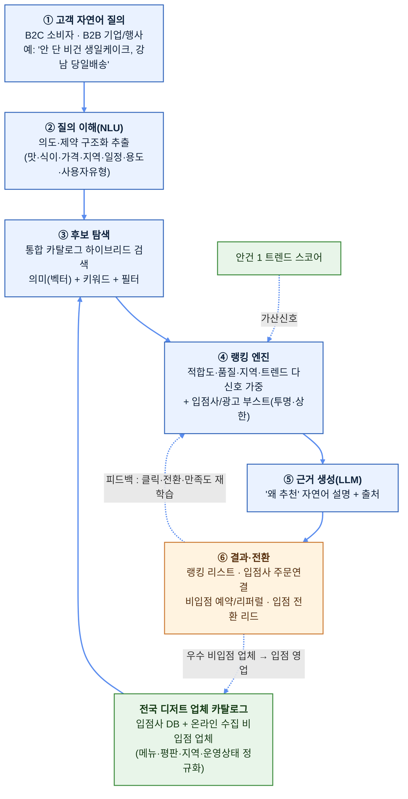

# 03. 자연어 질의 기반 전국 디저트 추천·랭킹 시스템 (안건 2)

> **한 줄 요약**: 고객(B2C 소비자·B2B 기업 모두)이 **자연어로 원하는 디저트를 문의**하면, 딸기로 입점사뿐 아니라 **사전에 온라인으로 수집한 전국의 현재 운영 중인 디저트 업체까지** 함께 분석·랭킹해 가장 적합한 곳을 추천하는 AI 검색·추천 엔진.

---

## 1. 문제 정의 (Why)

소비자는 "원하는 디저트"를 머릿속에 갖고 있지만, **그것을 만드는 가장 적합한 가게를 찾는 일**은 여전히 어렵다.

- 검색이 **키워드 매칭** 수준 → "비건이면서 안 단 생일 케이크, 당일배송 되는 곳" 같은 **복합·자연어 의도**를 못 푼다.
- 정보가 흩어져 있다(인스타·네이버·배달앱·블로그) → 비교·랭킹을 **사람이 수동으로** 해야 한다.
- 플랫폼 입점사 카탈로그만으로는 **커버리지가 부족**하다(특정 지역·특수 디저트는 입점사에 없을 수 있음) → 고객이 이탈한다.

**딸기로의 기회**: 자연어 의도를 정확히 이해하고, **입점사 + 전국 비입점 디저트 업체를 통합한 카탈로그**를 대상으로 다신호 랭킹을 매기면, "이 디저트엔 여기가 최적"이라는 답을 **즉시·근거와 함께** 줄 수 있다. 이는 단순 검색이 아니라 **디저트 발견(discovery)의 표준 관문**을 선점하는 일이다.

> **전제(현 시점)**: 딸기로는 자체 보유 데이터가 없다. 따라서 업체 카탈로그·평판 신호도 **인터넷 공개 데이터로 부트스트랩**한다(상세: [04_인터넷데이터_활용방법.md](04_인터넷데이터_활용방법.md)). 고객 질의 로그·클릭·전환 데이터가 쌓일수록 고유 자산(데이터 해자)이 된다.

## 2. 솔루션 개요 (What)

**자연어 in → 랭킹된 업체 리스트 out.** 3계층 가치:

| 계층 | 기능 | 사용자 가치 |
|------|------|-------------|
| **이해(Understand)** | 자연어 질의에서 의도·제약(맛·식이·가격·지역·일정·용도) 구조화 추출 | "말하듯 물어보면 알아듣는다" |
| **탐색(Retrieve)** | 입점사 + 전국 비입점 업체 통합 카탈로그에서 후보 검색(의미+키워드 하이브리드) | 한 곳에서 전국을 비교 |
| **랭킹(Rank)** | 적합도·품질·지역·트렌드 다신호 가중 스코어로 정렬 + 추천 근거 생성 | "왜 여기가 1등인지"까지 |

**멀티 오디언스**: 동일 엔진이 **B2C(소비자: '나 먹을/선물할 디저트')** 와 **B2B(기업·행사·입점사 소싱: '대량·납품 가능 업체')** 를 모두 처리한다. 의도 추출 단계에서 사용자 유형·용도(개인/선물/행사/B2B 대량)를 분기한다.

### 2.1 추천 대상 정책 — "왜 경쟁 업체까지 추천하나" (확정 방향)

비입점 전국 업체까지 추천에 포함하는 것은 의도된 전략이며, 네 가지 목적을 **동시에** 달성한다.

1. **신뢰 우선 → 입점 전환 깔때기**: 솔직하게 전국 최적 업체를 보여줘 "디저트 검색 = 딸기로"라는 신뢰·트래픽을 선점하고, 추천에 자주 노출되는 우수 비입점 업체를 **영업·입점 전환**시키는 리드 소스로 활용.
2. **수익화(중개·광고)**: 비입점 업체 노출/연결 시 중개 수수료·예약·광고·리퍼럴로 직접 수익화 여지.
3. **커버리지 = 데이터 해자**: 전국 수요(고객 질의)·공급(업체) 양면 데이터를 축적 → 추천·트렌드(안건 1) 정확도를 복제 난도 높게 끌어올림.
4. **입점사 우선, 경쟁사는 보완**: 기본은 입점사 노출을 **투명하게 부스트**하되, 입점사가 못 채우는 지역·카테고리 공백을 비입점 업체로 메워 **고객 이탈을 방지**.

> 설계 원칙: 랭킹의 **1차 정렬은 항상 "고객 적합도"**(신뢰의 근간)로 하고, 상업적 부스트(입점사·광고)는 **별도 레이어로 투명하게** 가산한다. 적합도를 훼손하는 부스트는 장기 신뢰(=깔때기·해자)를 파괴하므로 상한을 둔다.

## 3. 시스템 아키텍처

핵심은 **(a) 자연어 의도의 정확한 구조화**, **(b) 입점사+전국 업체 통합 카탈로그**, **(c) 적합도 1차 + 상업 부스트 분리형 다신호 랭킹**, **(d) 클릭·전환 피드백 루프**다.

## 4. 전국 디저트 업체 카탈로그 (Supply 데이터)

추천 품질의 토대는 **얼마나 넓고 정확한 업체 카탈로그**를 갖느냐다. 수집 인프라는 안건 1과 공유한다([04_인터넷데이터_활용방법.md](04_인터넷데이터_활용방법.md), [guides/](guides/)).

### 4.1 업체 데이터 소스
| 항목 | 소스 예시 | 수집 방식 |
|------|-----------|-----------|
| 업체 기본정보(상호·주소·영업상태·연락처) | 지도/플레이스(네이버·구글), 공공데이터(식품위생업소) | API/공공데이터 우선 |
| 메뉴·가격·이미지 | 업체 SNS·홈페이지·배달앱 | API/크롤(약관 준수) |
| 평판·리뷰·평점 | 플레이스 리뷰, 블로그, SNS 언급 | API/크롤 + 감성분석 |
| 식이/특성 태그(비건·글루텐프리·저당·알러지) | 메뉴 설명·리뷰 텍스트에서 LLM 추출 | 파이프라인 가공 |
| 운영 상태(현재 영업 여부·휴폐업) | 공공데이터 + 주기 재검증 | 정기 갱신 |

> **"현재 운용 중"의 보장**: 폐업·휴업 업체 추천은 치명적 → 공공데이터(인허가/영업상태) 대조 + 주기적 재크롤로 **신선도(freshness)** 를 카탈로그 핵심 KPI로 관리.

### 4.2 정규화 & 엔티티 해소
- 동일 업체가 여러 소스에 다른 표기로 존재 → **엔티티 레졸루션(중복 병합)**: 상호+주소+좌표 기반 매칭.
- 메뉴/특성은 **공통 택소노미**(카테고리·맛·식이·용도)로 정규화해 검색·필터 가능하게.
- 각 업체·메뉴를 **임베딩**해 벡터 DB에 적재(의미 검색용; pgvector → 전용 — [guides/07](guides/)).

> ⚖️ **법적 주의**: 업체 정보·리뷰 수집은 robots.txt·약관·저작권·개인정보를 준수. 공공데이터/공식 API 우선, 리뷰는 **원문 전재 대신 점수·요약·통계** 중심. TIPS 제안 시 "합법적 수집 거버넌스" 명시.

## 5. 자연어 이해 & 후보 탐색 (핵심 R&D)

### 5.1 질의 이해 (NLU)
- LLM(Claude)으로 자연어 질의를 **구조화 슬롯**으로 변환:
  `{디저트유형, 맛/식감, 식이제약(비건·글루텐프리·저당·견과류회피), 가격대, 지역/배송, 일정(당일·예약), 용도(개인·선물·행사·B2B대량), 수량}`.
- **모호성 처리**: 빠진 핵심 슬롯(예: 지역)은 되묻거나 합리적 기본값(고객 위치) 적용.
- **사용자 유형 분기**: B2C/B2B를 의도에서 추론해 후속 랭킹·결과 포맷을 다르게.

### 5.2 하이브리드 검색 (Retrieve)
- **벡터(의미) 검색**: 질의 임베딩 ↔ 업체/메뉴 임베딩 유사도 → 키워드로는 못 잡는 의도 매칭("입에서 녹는 부드러운" 등).
- **키워드/필터 검색**: 지역·식이·가격·운영상태 등 **하드 제약**은 정확 필터로(의미검색이 위반하면 안 되는 조건).
- 둘을 결합(하이브리드)해 후보군(top-K) 생성 → 6장 랭킹으로 넘김.

## 6. 랭킹·스코어링 엔진 (차별화 핵심)

후보 업체별 **다신호 가중 스코어**를 산출한다. 사용자가 우선순위로 지정한 4대 신호를 모두 결합한다.

| 신호 | 측정 | 비고 |
|------|------|------|
| **① 질의 적합도(의미 매칭)** | 질의-업체/메뉴 의미 유사도 + 하드제약 충족도 | **1차 정렬 기준(신뢰의 근간)** |
| **② 품질·평판** | 리뷰 평점·언급량·감성·최신성 | 광고성/조작 리뷰 필터링 |
| **③ 지역·배송 가능성** | 고객 위치 기준 배송권·거리·운영시간·당일가능 | 하드 제약은 필터, 정도는 가산 |
| **④ 트렌드(안건 1 연계)** | 해당 아이템/업체의 안건 1 트렌드 스코어 | "지금 뜨는 곳" 가산 |

**상업 레이어(투명·상한 적용, 적합도와 분리):**
- **입점사 부스트**: 적합도 동등 시 입점사 우선. 단, 적합도 상위 결과를 밀어내지 않도록 **부스트 상한** + "딸기로 입점사" 배지로 **투명 표기**.
- **광고/리퍼럴 노출**: 별도 슬롯/라벨로 명확히 구분("광고" 표기) — 오가닉 랭킹 오염 금지.

**점수 공식(개념)**: `Score = w₁·적합도 + w₂·품질 + w₃·지역 + w₄·트렌드 (+ 입점사부스트 ≤ cap)`
가중치 wᵢ는 사용자 유형·용도별로 프로파일링(예: B2B 대량은 지역·생산능력↑, 선물은 품질·평판↑). 초기엔 규칙 기반, 이후 **클릭·전환 피드백으로 학습(Learning-to-Rank)**.

### 6.1 근거 생성 (LLM)
- 상위 결과마다 **"왜 추천하는가"**를 Claude로 자연어 생성 + **출처 링크**(리뷰·메뉴 근거).
- 환각 통제: 점수·사실(메뉴·영업상태)은 코드/DB로 확정하고, LLM은 **설명 문장 생성만** 담당.

## 7. 결과 표출 & 전환 (Conversion)

- **랭킹 리스트**: 업체 카드(대표 메뉴·평점·거리·배지·추천 사유·가격대). 입점사/광고 라벨 투명 표기.
- **입점사**: 딸기로 주문·결제 플로우로 **직접 전환**(핵심 매출).
- **비입점 업체**: 외부 연결/예약/리퍼럴(수익화) + **"우수 비입점 업체 → 입점 영업 리드"** 자동 적재.
- **피드백 수집**: 클릭·선택·만족도 → 랭킹 재학습 + 카탈로그 보강.

## 8. 기술 스택 (제안 예시)

| 영역 | MVP 권장 | 확장 |
|------|----------|------|
| 카탈로그 수집 | Python + 스케줄러(안건 1 공유) | Airflow/Dagster, 큐 |
| 저장/검색 | PostgreSQL + **pgvector**(하이브리드 검색) | 전용 벡터/검색엔진(예: OpenSearch) |
| NLU/랭킹 | Claude API(슬롯 추출·근거) + 규칙 스코어 | Learning-to-Rank 모델, 리랭커 |
| 백엔드 | FastAPI/Node | 마이크로서비스 |
| 프론트 | Next.js(검색 UI/채팅형) | 모바일 앱 |
| 인프라 | 단일 클라우드(관리형) | 컨테이너 오케스트레이션, IaC |

> 상세 셋업은 [guides/](guides/) 참조(pgvector·Claude·스케줄러 등). 안건 1과 수집·저장·LLM 인프라를 **공유**해 비용·인력 효율화.

## 9. 단계적 로드맵 (MVP → 확장)

### Phase 0 — PoC (1~2개월)
- 한 지역(예: 서울 일부)·핵심 카테고리만 카탈로그 구축(입점사 + 수백 개 비입점).
- 자연어 질의 → 슬롯 추출 → 하이브리드 검색 → 규칙 랭킹 → 근거 생성까지 end-to-end 1개 흐름.
- **목표**: "자연어로 물으면 납득되는 추천이 나오는가" 검증.

### Phase 1 — MVP 서비스 (3~5개월)
- 카탈로그 전국 확대(주요 도시), 운영상태 재검증 파이프라인, 검색 UI(채팅형), 입점사 주문 연결.

### Phase 2 — 개인화·수익화 (6~9개월)
- 클릭·전환 피드백 기반 Learning-to-Rank, 입점 전환 리드 파이프라인, 광고·리퍼럴 수익 모듈, B2B 소싱 모드.

### Phase 3 — 고도화 (10개월~)
- 도메인 리랭커/파인튜닝, 안건 1 트렌드 결합 심화, 추천 API의 B2B SaaS 판매.

## 10. TIPS 포지셔닝 (제안서 논리)

### 10.1 기술성 / R&D 도전 과제

> **포지셔닝**: 단순 검색 API 연동이 아니라, **복합 자연어 의도를 하드제약까지 충족시켜 랭킹하는 정확도 R&D**다. 아래 5대 난제는 키워드 매칭/단일 임베딩으로는 목표 품질이 안 나오는 문제이며, 각각 베이스라인 대비 정량 목표와 자체 기법을 둔다.

| # | R&D 난제 (왜 연구인가) | 베이스라인 한계 | 정량 목표(KPI)¹ | 자체 기법 |
|---|------------------------|-----------------|-----------------|-----------|
| 1 | **자연어 의도 → 구조화 슬롯** — 맛·식이·가격·지역·일정·용도 동시 해석 | 키워드/정규식은 복합·암묵 제약(예: "안 단 비건") **누락** | 핵심 슬롯 추출 **F1 ≥ 0.85**, 모호 질의 **되묻기 적중 ≥ 0.8** | LLM 슬롯 추출 + 스키마 검증 + 모호성 능동 질의 |
| 2 | **하이브리드 검색 + 다신호 LTR** — 의미·키워드·하드제약·평판·지역·트렌드 융합 | BM25/단일 임베딩은 의도-제약 **동시 충족** 약함 | 랭킹 품질 **nDCG@10 규칙기반 대비 +20%**, 하드제약(식이·지역) **위반 추천율 ≤ 1%** | 의미+키워드+하드필터 하이브리드 → 클릭·전환 피드백 Learning-to-Rank |
| 3 | **전국 카탈로그 엔티티 레졸루션 & 신선도** — 멀티소스 중복병합 + 운영상태 보장 | 상호명 단순매칭은 중복·동명이인·폐업 **오류** | 중복 병합 **정확도 ≥ 0.95**, **폐업·휴업 오추천율 ≤ 1%**(신선도 KPI) | 상호+주소+좌표 매칭 + 공공데이터 대조 주기 재검증 |
| 4 | **상업 부스트와 적합도의 분리·통제** — 신뢰 지키며 수익화 | 광고 혼입은 오가닉 랭킹 **오염**·신뢰 훼손 | 부스트 후에도 **적합도 상위 결과 보존율 ≥ 95%**, 부스트 상한·감사로그 **준수 100%** | 적합도 1차 정렬 고정 + 부스트 별도 레이어(상한·라벨·감사) |
| 5 | **환각 통제형 근거 생성** — "왜 추천" 자연어 + 출처 | LLM 단독은 영업상태·메뉴를 **지어냄** | 사실(영업상태·메뉴) **오류율 ≤ 1%**, **출처 추적률 100%** | 사실/점수=DB·코드, 설명=LLM 책임 분리 + citation |

¹ **목표치는 제안 단계 가정**이다. PoC(서울 일부·핵심 카테고리, [§9 Phase 0](#9-단계적-로드맵-mvp--확장))에서 골든셋·클릭 로그로 1차 측정하고, 운영 피드백(규칙기반 → LTR 전환)으로 캘리브레이션한다. → **"매칭 정확도 자체가 R&D 산출물"**. 평가 '개발 실현성' 항목 대응으로 **검증 환경·방법을 구체화하고 가능하면 제3자 공인**으로 객관성을 더한다([01 §3](01_TIPS제안서_갭분석및체크리스트.md)).

### 10.2 혁신성·차별성
- **양면 데이터 해자**: 수요(자연어 질의 로그)×공급(전국 카탈로그) 데이터가 시간이 갈수록 추천 정확도와 복제 난도를 높임.
- **단순 검색이 아닌 "발견+전환+공급확장"의 결합**: 추천이 곧 입점 영업 리드·수익화·트렌드 데이터로 순환.
- **안건 1과의 시너지**: 트렌드 예측(안건 1)과 수요 매칭(안건 2)이 같은 데이터/인프라 위에서 상호 강화.

### 10.3 사업화 / 시장성
- **직접 매출**: 입점사 주문 전환. **신규 매출**: 비입점 중개·예약·광고·리퍼럴. **공급 확장**: 우수 업체 입점 전환.
- **확장**: 추천·랭킹 엔진을 **B2B SaaS/API**로 타 F&B 플랫폼에 제공.
- 디저트 발견의 관문을 선점 → 트래픽·데이터·거래의 선순환.

### 10.4 성과 지표(KPI) 예시
- **기술 KPI**: §10.1 표 참조(슬롯 추출 F1, nDCG@10, 하드제약 위반율, 엔티티 병합 정확도·신선도, 부스트 보존율, 환각 오류율).
- **사업·운영 KPI**: 추천 적중률(클릭·전환), 질의 충족률(되묻기 없이 해결), 카탈로그 커버리지, 입점 전환 리드 수, 비입점 수익화 매출, B2C/B2B 재방문율.

## 11. 리스크 & 대응

| 리스크 | 대응 |
|--------|------|
| 폐업·휴업 업체 추천 | 공공데이터 대조 + 주기 재검증, 신선도 KPI |
| 크롤링/리뷰 법적 이슈 | 공식 API·공공데이터 우선, 약관·저작권 준수, 점수·요약 중심 |
| 상업 부스트가 신뢰 훼손 | 적합도 1차 정렬 고정, 부스트 상한·투명 라벨·감사 로그 |
| 리뷰 조작·광고성 신호 | 이상탐지·소스 신뢰도 가중, 감성·진정성 필터 |
| LLM 환각/비용 | 사실-설명 책임 분리, 모델 티어링·캐싱, 출처 추적 |
| 콜드스타트(피드백 부족) | 초기 규칙 기반 랭킹 → 데이터 축적 후 LTR 전환 |
| 비입점 업체 반발/관계 | 노출 옵트아웃·정정 채널, 입점 인센티브로 win-win |

## 12. 안건 1과의 관계
- **공유**: 데이터 수집·저장·벡터검색·LLM·스케줄러 인프라([04](04_인터넷데이터_활용방법.md), [guides/](guides/)).
- **연계**: 안건 1의 트렌드 스코어가 안건 2 랭킹의 ④ 신호로 가산되고, 안건 2의 질의 로그(수요)가 안건 1 트렌드 예측을 보강 → **상호 강화 루프**.
- 비용은 공유 인프라 기준으로 [05_비용가이드.md](05_비용가이드.md)에 합산 산정(추후 갱신).

## 13. 다음 작업 메모
- 입점사 카탈로그 규모·업종 분포 확인 후 §6 가중치 프로파일 구체화.
- 카탈로그 1차 수집 범위(지역·카테고리·목표 업체 수) 확정 → §9 Phase 0 스코프 픽스.
- 수익화 모델(중개 수수료율·광고 단가) 가정치 정해 [05_비용가이드.md](05_비용가이드.md)에 매출/비용 양면 반영.
- LLM 단가·토큰은 `claude-api` 스킬로 확인 후 비용표 갱신.
