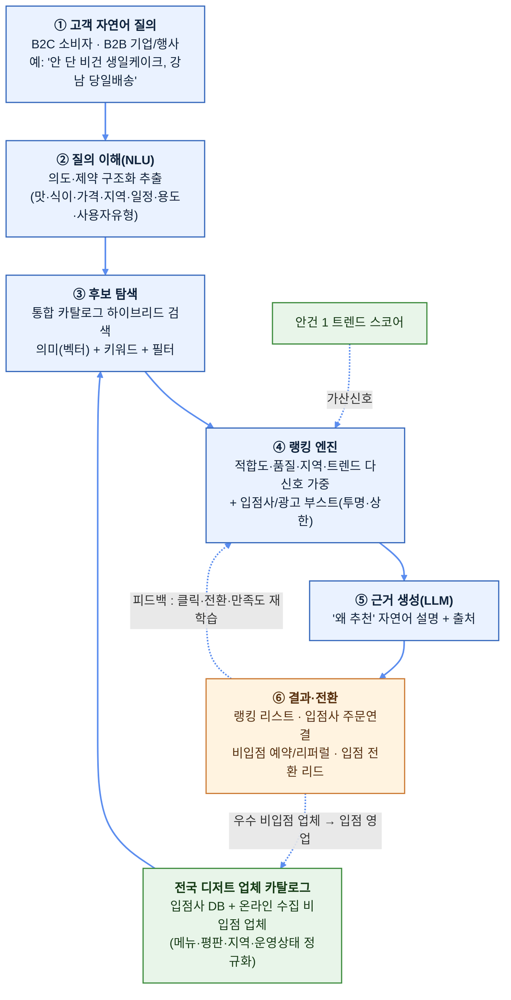

# 03. 자연어 질의 기반 전국 디저트 추천·랭킹 시스템 (안건 2)

> **한 줄 요약**: 고객(B2C 소비자·B2B 기업 모두)이 **자연어로 원하는 디저트를 문의**하면, 딸기로 입점사뿐 아니라 **사전에 온라인으로 수집한 전국의 현재 운영 중인 디저트 업체까지** 함께 분석·랭킹해 가장 적합한 곳을 추천하는 AI 검색·추천 엔진.

---

## 1. 문제 정의 (Why)

소비자는 "원하는 디저트"를 머릿속에 갖고 있지만, **그것을 만드는 가장 적합한 가게를 찾는 일**은 여전히 어렵다.

- 검색이 **키워드 매칭** 수준 → "비건이면서 안 단 생일 케이크, 당일배송 되는 곳" 같은 **복합·자연어 의도**를 못 푼다.
- 정보가 흩어져 있다(인스타·네이버·배달앱·블로그) → 비교·랭킹을 **사람이 수동으로** 해야 한다.
- 플랫폼 입점사 카탈로그만으로는 **커버리지가 부족**하다(특정 지역·특수 디저트는 입점사에 없을 수 있음) → 고객이 이탈한다.

**딸기로의 기회**: 자연어 의도를 정확히 이해하고, **입점사 + 전국 비입점 디저트 업체를 통합한 카탈로그**를 대상으로 다신호 랭킹을 매기면, "이 디저트엔 여기가 최적"이라는 답을 **즉시·근거와 함께** 줄 수 있다. 이는 단순 검색이 아니라 **디저트 발견(discovery)의 표준 관문**을 선점하는 일이다.

> **전제(2026-06-18 업데이트)**: 딸기로(딸기로픽, 동일 법인)는 **자사 실거래 데이터 + 픽미 공동연구 산출물(가게 랭킹 대시보드 = 본 시스템의 선행 PoC, 방법론 4종 상세 [07](07_픽미공동연구_분석방법론.md))** 을 이미 보유한다. 특히 공동연구의 **가게 자체 등급 계산식**([07 §3](07_픽미공동연구_분석방법론.md))은 본 랭킹의 **스코어링 베이스라인(자체 v1)**, **클러스터링**([07 §4](07_픽미공동연구_분석방법론.md))은 세그먼트·개인화의 선행 자산이다. 전국 비입점 업체 카탈로그·평판 신호는 **인터넷 공개 데이터로 보완**한다(상세: [04_인터넷데이터_활용방법.md](04_인터넷데이터_활용방법.md)). 고객 질의 로그·클릭·전환 데이터가 쌓일수록 해자가 강화된다.

## 2. 솔루션 개요 (What)

**자연어 in → 랭킹된 업체 리스트 out.** 3계층 가치:

| 계층 | 기능 | 사용자 가치 |
|------|------|-------------|
| **이해(Understand)** | 자연어 질의에서 의도·제약(맛·식이·가격·지역·일정·용도) 구조화 추출 | "말하듯 물어보면 알아듣는다" |
| **탐색(Retrieve)** | 입점사 + 전국 비입점 업체 통합 카탈로그에서 후보 검색(의미+키워드 하이브리드) | 한 곳에서 전국을 비교 |
| **랭킹(Rank)** | 적합도·품질·지역·트렌드 다신호 가중 스코어로 정렬 + 추천 근거 생성 | "왜 여기가 1등인지"까지 |

**멀티 오디언스**: 동일 엔진이 **B2C(소비자: '나 먹을/선물할 디저트')** 와 **B2B(기업·행사·입점사 소싱: '대량·납품 가능 업체')** 를 모두 처리한다. 의도 추출 단계에서 사용자 유형·용도(개인/선물/행사/B2B 대량)를 분기한다.

### 2.1 추천 대상 정책 — "왜 경쟁 업체까지 추천하나" (확정 방향)

비입점 전국 업체까지 추천에 포함하는 것은 의도된 전략이며, 네 가지 목적을 **동시에** 달성한다.

1. **신뢰 우선 → 입점 전환 깔때기**: 솔직하게 전국 최적 업체를 보여줘 "디저트 검색 = 딸기로"라는 신뢰·트래픽을 선점하고, 추천에 자주 노출되는 우수 비입점 업체를 **영업·입점 전환**시키는 리드 소스로 활용.
2. **수익화(중개·광고)**: 비입점 업체 노출/연결 시 중개 수수료·예약·광고·리퍼럴로 직접 수익화 여지.
3. **커버리지 = 데이터 해자**: 전국 수요(고객 질의)·공급(업체) 양면 데이터를 축적 → 추천·트렌드(안건 1) 정확도를 복제 난도 높게 끌어올림.
4. **입점사 우선, 경쟁사는 보완**: 기본은 입점사 노출을 **투명하게 부스트**하되, 입점사가 못 채우는 지역·카테고리 공백을 비입점 업체로 메워 **고객 이탈을 방지**.

> 설계 원칙: 랭킹의 **1차 정렬은 항상 "고객 적합도"**(신뢰의 근간)로 하고, 상업적 부스트(입점사·광고)는 **별도 레이어로 투명하게** 가산한다. 적합도를 훼손하는 부스트는 장기 신뢰(=깔때기·해자)를 파괴하므로 상한을 둔다.

## 3. 시스템 아키텍처

핵심은 **(a) 자연어 의도의 정확한 구조화**, **(b) 입점사+전국 업체 통합 카탈로그**, **(c) 적합도 1차 + 상업 부스트 분리형 다신호 랭킹**, **(d) 클릭·전환 피드백 루프**다.

## 4. 전국 디저트 업체 카탈로그 (Supply 데이터)

추천 품질의 토대는 **얼마나 넓고 정확한 업체 카탈로그**를 갖느냐다. 수집 인프라는 안건 1과 공유한다([04_인터넷데이터_활용방법.md](04_인터넷데이터_활용방법.md), [guides/](guides/)).

### 4.1 업체 데이터 소스

| 항목 | 소스 예시 | 수집 방식 |
|------|-----------|-----------|
| 업체 기본정보(상호·주소·영업상태·연락처) | 지도/플레이스(네이버·구글), 공공데이터(식품위생업소) | API/공공데이터 우선 |
| 메뉴·가격·이미지 | 업체 SNS·홈페이지·배달앱 | API/크롤(약관 준수) |
| 평판·리뷰·평점 | 플레이스 리뷰, 블로그, SNS 언급 | API/크롤 + 감성분석 |
| 식이/특성 태그(비건·글루텐프리·저당·알러지) | 메뉴 설명·리뷰 텍스트에서 LLM 추출 | 파이프라인 가공 |
| 운영 상태(현재 영업 여부·휴폐업) | 공공데이터 + 주기 재검증 | 정기 갱신 |

> **"현재 운용 중"의 보장**: 폐업·휴업 업체 추천은 치명적 → 공공데이터(인허가/영업상태) 대조 + 주기적 재크롤로 **신선도(freshness)** 를 카탈로그 핵심 KPI로 관리.

### 4.2 정규화 & 엔티티 해소

- 동일 업체가 여러 소스에 다른 표기로 존재 → **엔티티 레졸루션(중복 병합)**: 상호+주소+좌표 기반 매칭.
- 메뉴/특성은 **공통 택소노미**(카테고리·맛·식이·용도)로 정규화해 검색·필터 가능하게.
- 각 업체·메뉴를 **임베딩**해 벡터 DB에 적재(의미 검색용; pgvector → 전용 — [guides/07](guides/)).

> ⚖️ **법적 주의**: 업체 정보·리뷰 수집은 robots.txt·약관·저작권·개인정보를 준수. 공공데이터/공식 API 우선, 리뷰는 **원문 전재 대신 점수·요약·통계** 중심. TIPS 제안 시 "합법적 수집 거버넌스" 명시.

## 5. 자연어 이해 & 후보 탐색 (핵심 R&D)

### 5.1 질의 이해 (NLU)

- LLM(Claude)으로 자연어 질의를 **구조화 슬롯**으로 변환:
  `{디저트유형, 맛/식감, 식이제약(비건·글루텐프리·저당·견과류회피), 가격대, 지역/배송, 일정(당일·예약), 용도(개인·선물·행사·B2B대량), 수량}`.
- **모호성 처리**: 빠진 핵심 슬롯(예: 지역)은 되묻거나 합리적 기본값(고객 위치) 적용.
- **사용자 유형 분기**: B2C/B2B를 의도에서 추론해 후속 랭킹·결과 포맷을 다르게.

### 5.2 하이브리드 검색 (Retrieve)

- **벡터(의미) 검색**: 질의 임베딩 ↔ 업체/메뉴 임베딩 유사도 → 키워드로는 못 잡는 의도 매칭("입에서 녹는 부드러운" 등).
- **키워드/필터 검색**: 지역·식이·가격·운영상태 등 **하드 제약**은 정확 필터로(의미검색이 위반하면 안 되는 조건).
- 둘을 결합(하이브리드)해 후보군(top-K) 생성 → 6장 랭킹으로 넘김.

## 6. 랭킹·스코어링 엔진 (차별화 핵심)

후보 업체별 **다신호 가중 스코어**를 산출한다. 사용자가 우선순위로 지정한 4대 신호를 모두 결합한다.

| 신호 | 측정 | 비고 |
|------|------|------|
| **① 질의 적합도(의미 매칭)** | 질의-업체/메뉴 의미 유사도 + 하드제약 충족도 | **1차 정렬 기준(신뢰의 근간)** |
| **② 품질·평판** | 리뷰 평점·언급량·감성·최신성 | 광고성/조작 리뷰 필터링 |
| **③ 지역·배송 가능성** | 고객 위치 기준 배송권·거리·운영시간·당일가능 | 하드 제약은 필터, 정도는 가산 |
| **④ 트렌드(안건 1 연계)** | 해당 아이템/업체의 안건 1 트렌드 스코어 | "지금 뜨는 곳" 가산 |

**상업 레이어(투명·상한 적용, 적합도와 분리):**

- **입점사 부스트**: 적합도 동등 시 입점사 우선. 단, 적합도 상위 결과를 밀어내지 않도록 **부스트 상한** + "딸기로 입점사" 배지로 **투명 표기**.
- **광고/리퍼럴 노출**: 별도 슬롯/라벨로 명확히 구분("광고" 표기) — 오가닉 랭킹 오염 금지.

**점수 공식(개념)**: `Score = w₁·적합도 + w₂·품질 + w₃·지역 + w₄·트렌드 (+ 입점사부스트 ≤ cap)`
가중치 wᵢ는 사용자 유형·용도별로 프로파일링(예: B2B 대량은 지역·생산능력↑, 선물은 품질·평판↑). 초기엔 규칙 기반, 이후 **클릭·전환 피드백으로 학습(Learning-to-Rank)**.

### 6.1 근거 생성 (LLM)

- 상위 결과마다 **"왜 추천하는가"**를 Claude로 자연어 생성 + **출처 링크**(리뷰·메뉴 근거).
- 환각 통제: 점수·사실(메뉴·영업상태)은 코드/DB로 확정하고, LLM은 **설명 문장 생성만** 담당.

## 7. 결과 표출 & 전환 (Conversion)

- **랭킹 리스트**: 업체 카드(대표 메뉴·평점·거리·배지·추천 사유·가격대). 입점사/광고 라벨 투명 표기.
- **입점사**: 딸기로 주문·결제 플로우로 **직접 전환**(핵심 매출).
- **비입점 업체**: 외부 연결/예약/리퍼럴(수익화) + **"우수 비입점 업체 → 입점 영업 리드"** 자동 적재.
- **피드백 수집**: 클릭·선택·만족도 → 랭킹 재학습 + 카탈로그 보강.

## 8. 기술 스택 (제안 예시)

| 영역 | MVP 권장 | 확장 |
|------|----------|------|
| 카탈로그 수집 | Python + 스케줄러(안건 1 공유) | Airflow/Dagster, 큐 |
| 저장/검색 | PostgreSQL + **pgvector**(하이브리드 검색) | 전용 벡터/검색엔진(예: OpenSearch) |
| NLU/랭킹 | Claude API(슬롯 추출·근거) + 규칙 스코어 | Learning-to-Rank 모델, 리랭커 |
| 백엔드 | FastAPI/Node | 마이크로서비스 |
| 프론트 | Next.js(검색 UI/채팅형) | 모바일 앱 |
| 인프라 | 단일 클라우드(관리형) | 컨테이너 오케스트레이션, IaC |

> 상세 셋업은 [guides/](guides/) 참조(pgvector·Claude·스케줄러 등). 안건 1과 수집·저장·LLM 인프라를 **공유**해 비용·인력 효율화.

## 9. 단계적 로드맵 (MVP → 확장)

### Phase 0 — PoC (1~2개월)

- 한 지역(예: 서울 일부)·핵심 카테고리만 카탈로그 구축(입점사 + 수백 개 비입점).
- 자연어 질의 → 슬롯 추출 → 하이브리드 검색 → 규칙 랭킹 → 근거 생성까지 end-to-end 1개 흐름.
- **목표**: "자연어로 물으면 납득되는 추천이 나오는가" 검증.

### Phase 1 — MVP 서비스 (3~5개월)

- 카탈로그 전국 확대(주요 도시), 운영상태 재검증 파이프라인, 검색 UI(채팅형), 입점사 주문 연결.

### Phase 2 — 개인화·수익화 (6~9개월)

- 클릭·전환 피드백 기반 Learning-to-Rank, 입점 전환 리드 파이프라인, 광고·리퍼럴 수익 모듈, B2B 소싱 모드.

### Phase 3 — 고도화 (10개월~)

- 도메인 리랭커/파인튜닝, 안건 1 트렌드 결합 심화, 추천 API의 B2B SaaS 판매.

## 10. TIPS 포지셔닝 (제안서 논리)

### 10.1 기술성 / R&D 도전 과제

> **포지셔닝**: 단순 검색 API 연동이 아니라, **복합 자연어 의도를 하드제약까지 충족시켜 랭킹하는 정확도 R&D**다. 아래 5대 난제는 키워드 매칭/단일 임베딩으로는 목표 품질이 안 나오는 문제이며, 각각 베이스라인 대비 정량 목표와 자체 기법을 둔다.

| # | R&D 난제 (왜 연구인가) | 베이스라인 한계 | 정량 목표(KPI)¹ | 자체 기법 |
|---|------------------------|-----------------|-----------------|-----------|
| 1 | **자연어 의도 → 구조화 슬롯** — 맛·식이·가격·지역·일정·용도 동시 해석 | 키워드/정규식은 복합·암묵 제약(예: "안 단 비건") **누락** | 핵심 슬롯 추출 **F1 ≥ 0.85**, 모호 질의 **되묻기 적중 ≥ 0.8** | LLM 슬롯 추출 + 스키마 검증 + 모호성 능동 질의 |
| 2 | **하이브리드 검색 + 다신호 LTR** — 의미·키워드·하드제약·평판·지역·트렌드 융합 | BM25/단일 임베딩은 의도-제약 **동시 충족** 약함 | 랭킹 품질 **nDCG@10 규칙기반 대비 +20%**, 하드제약(식이·지역) **위반 추천율 ≤ 1%** | 의미+키워드+하드필터 하이브리드 → 클릭·전환 피드백 Learning-to-Rank |
| 3 | **전국 카탈로그 엔티티 레졸루션 & 신선도** — 멀티소스 중복병합 + 운영상태 보장 | 상호명 단순매칭은 중복·동명이인·폐업 **오류** | 중복 병합 **정확도 ≥ 0.95**, **폐업·휴업 오추천율 ≤ 1%**(신선도 KPI) | 상호+주소+좌표 매칭 + 공공데이터 대조 주기 재검증 |
| 4 | **상업 부스트와 적합도의 분리·통제** — 신뢰 지키며 수익화 | 광고 혼입은 오가닉 랭킹 **오염**·신뢰 훼손 | 부스트 후에도 **적합도 상위 결과 보존율 ≥ 95%**, 부스트 상한·감사로그 **준수 100%** | 적합도 1차 정렬 고정 + 부스트 별도 레이어(상한·라벨·감사) |
| 5 | **환각 통제형 근거 생성** — "왜 추천" 자연어 + 출처 | LLM 단독은 영업상태·메뉴를 **지어냄** | 사실(영업상태·메뉴) **오류율 ≤ 1%**, **출처 추적률 100%** | 사실/점수=DB·코드, 설명=LLM 책임 분리 + citation |

¹ **목표치는 제안 단계 가정**이다. PoC(서울 일부·핵심 카테고리, [§9 Phase 0](#9-단계적-로드맵-mvp--확장))에서 골든셋·클릭 로그로 1차 측정하고, 운영 피드백(규칙기반 → LTR 전환)으로 캘리브레이션한다. → **"매칭 정확도 자체가 R&D 산출물"**. 평가 '개발 실현성' 항목 대응으로 **검증 환경·방법을 구체화하고 가능하면 제3자 공인**으로 객관성을 더한다([01 §3](01_TIPS제안서_갭분석및체크리스트.md)).

#### 10.1.1 KPI 읽는 법 — 각 목표치의 근거와 수준 (심사역용 해설)

> 아래는 위 표의 숫자가 **어디서 나왔고(근거)**, **왜 그 값이 합격선인지(기준점)**, **베이스라인 대비 우리가 어느 수준까지 끌어올리는지(개선폭)**를 비전문가도 읽을 수 있게 풀어 쓴 것이다. 베이스라인의 절대 수치는 **동일 골든셋에서 우리 기법과 나란히 실측**(§10.1 검증 설계)해 비교하므로, 핵심은 "절대값"이 아니라 **같은 시험지로 매긴 개선폭**이다.
>
> **읽기 전에, 자주 나오는 용어 3개만** (낚시 비유로 한 번에):
>
> - **정밀도** = "*맞다*고 고른 것 중 진짜 맞은 비율" → *그물로 건진 것 중 생선 비율*(쓰레기 안 섞였나).
> - **재현율** = "실제 정답 중 놓치지 않고 찾아낸 비율" → *강에 있던 생선 중 실제로 건진 비율*(놓친 거 없나).
> - **F1** = 위 둘을 **함께 보는 종합 점수**(한쪽만 잘해선 안 됨). 0~1 사이이고, **시험 점수처럼 1.0이 만점**이라 보면 된다(0.85 ≈ 85점).

**난제 1 — 손님 말을 조건표로 바꾸기 · `F1 ≥ 0.85`, 되묻기 적중 `≥ 0.8`**

- **무슨 문제냐면**: 손님이 *"안 단 비건 케이크 4만 원 이하로 추천해줘"* 라고 말하면, 기계는 이 한 문장을 〈맛 = 덜 달게〉〈식이 = 비건(우유·계란·꿀 X)〉〈종류 = 케이크〉〈가격 ≤ 4만 원〉이라는 **조건 카드 여러 장으로 정확히 쪼개야** 추천이 시작된다. 옛 방식(키워드 검색)은 '케이크'만 알아듣고 "**안** 단"의 *부정*, "비건" 같은 숨은 조건을 통째로 흘린다.
- **0.85점은 어느 정도냐면**: 이 작업의 점수(F1)가 85점이라는 뜻이고, 업계에서 **85~90점이면 "이제 실제 서비스에 써도 된다"**고 보는 통상 합격선이다. 그 아래면 손님이 *"내가 말한 조건 무시했네"*를 체감할 만큼 조건을 흘린다. 옛 방식은 부정·암묵 표현에 약해 추정 50~60점 — **손님이 건 조건의 절반쯤을 놓치는** 수준이다.
- **그래서 우리는**: 85점 ≈ **조건 10개 중 8~9개를 정확히 알아듣는다**(옛 방식 대비 +25~35점 도약). 못 알아들은 애매한 부분은 *"단맛은 어느 정도가 좋으세요?"* 처럼 **되물어서** 채우는데, 되묻기 적중 0.8 = **되물을 때 5번 중 4번은 정말 필요한 핵심을 콕 짚어** 엉뚱한 질문으로 손님을 귀찮게 하지 않는다.

**난제 2 — 좋은 가게를 위쪽에 놓기 · 랭킹 `nDCG@10 +20%`, 하드제약 `위반율 ≤ 1%`**

- **무슨 문제냐면**: 조건에 맞는 가게를 찾았어도 **"누구를 1등으로 보여줄까"** 순서가 핵심이다. 손님은 보통 위에서 2~3개만 본다. 그래서 *정말 잘 맞는 집이 맨 위에, 애매한 집이 아래로* 가야 한다.
- **nDCG@10이란**: *상위 10개를 얼마나 좋은 순서로 줄 세웠나*를 매기는 **채점관 점수**다(좋은 집이 1~3등에 오면 점수↑, 10등 밖으로 밀리면 점수↓). 검색·추천 품질의 사실상 표준 잣대.
- **왜 "절대 점수"가 아니라 "+20%"냐면**: 이 점수의 절대값은 시험 문제(골든셋) 구성에 따라 출렁여서 **"우리는 0.9 달성"식 절대 목표는 부풀리거나 깎기 쉽다**. 그래서 **똑같은 문제지에서 옛 방식(키워드+단일 임베딩) 대비 몇 % 더 잘했나**로 공정하게 비교한다. 여러 신호를 섞고(하이브리드) 손님 클릭·구매로 계속 학습(LTR)하는 방식은 단일 방식보다 **두 자릿수 % 개선이 흔히 기대되는 범위**라, +20%를 보수적으로 잡았다.
- **하드제약 위반율 ≤ 1%란**: 〈비건이라 했는데 우유 든 집〉처럼 **절대 어기면 안 되는 조건**을 어긴 추천 비율. 100번 중 1번 이하 = **신뢰의 마지노선**이고, 이 한 줄이 *"그냥 검색"* 과 *"믿고 쓰는 추천"* 을 가른다.

**난제 3 — 흩어진 같은 가게를 하나로 · 병합 `정확도 ≥ 0.95`, 폐업 `오추천율 ≤ 1%`**

- **무슨 문제냐면**: 똑같은 한 가게가 네이버엔 "○○제과", 카카오엔 "○○ 베이커리 본점", 공공데이터엔 다른 주소로 적혀 있곤 한다. 이걸 **"같은 가게다"라고 알아보고 하나로 합치는 일**(동창회 명단에서 *김민수·민수 김·M.Kim*을 한 사람으로 묶는 것과 같다).
- **0.95란**: 합쳐야 할 100쌍 중 **95쌍을 옳게 판정**한다는 뜻. 상호명만 보고 합치면 전국에 널린 "○○베이커리" 동명 가게가 뒤섞여 틀린다. 반면 **상호 + 주소 + 지도 좌표를 함께 대조**하면 통상 95점 이상까지 올라가서, 이를 합격선으로 둔다.
- **폐업 오추천율 ≤ 1%란**: 추천한 집이 **이미 문 닫았을 확률**. "갔더니 망한 집"은 신뢰를 한 번에 무너뜨리므로, 정부 공공데이터(인허가·폐업 정보)와 **주기적으로 대조**해 100곳 추천 시 1곳 이하로 막는다(이것이 '신선도' 지표).

**난제 4 — 광고를 얹어도 진짜 맛집은 위에 · 보존율 `≥ 95%`, 규칙 `준수 100%`**

- **무슨 문제냐면**: 돈을 받고 특정 가게를 밀어주면(광고·부스트) 수익은 나지만, **광고가 진짜 좋은 집을 밀어내면 손님 신뢰가 깨진다**. 그래서 *"광고는 허용하되, 진짜 잘 맞는 집은 위쪽에 그대로 남게"* 통제해야 한다.
- **보존율 95%란**: 광고를 끼워 넣어도 **원래 가장 잘 맞던 상위 결과가 그대로 남는 비율**. 95% = 광고가 추천 순서를 거의 흔들지 않는다는 뜻. 본 서비스 제1원칙 *"적합도로 먼저 줄 세우고, 수익화는 그 위 별도 층에서만"*(신뢰 우선)을 숫자로 못 박은 것이다.
- **준수 100%란**: 광고에 걸어 둔 *상한선·"광고" 라벨 표시·기록(감사로그)* 은 **사람 판단이 아니라 기계 규칙**이라, 지키는 게 당연(못 지키면 그건 버그)이다. 그래서 100%가 목표이며, 이 통제 구조가 *"돈 벌면서도 신뢰를 지킨다"* 는 차별성([§10.2](#102-혁신성차별성))의 근거가 된다.

**난제 5 — AI가 지어내지 못하게 · 사실 `오류율 ≤ 1%`, `출처 추적률 100%`**

- **무슨 문제냐면**: *"왜 이 집을 추천하는지"* 를 AI가 말로 설명해 주면 좋은데, **AI(LLM)는 모르면 그럴듯하게 지어내는 버릇**(환각)이 있다. 영업시간이나 메뉴를 사실과 다르게 말하면 곧장 신뢰가 깨진다.
- **어떻게 막냐면**: **숫자·사실은 데이터베이스(장부)에서 그대로 읽어 오고, AI는 그걸 자연스러운 말투로 옮기는 역할만** 하도록 일을 나눈다. AI가 사실을 만들어 낼 여지 자체를 없애므로 사실 오류율 ≤ 1%. 또 모든 사실 문장에 **"이건 어디서 나온 정보"라는 출처를 붙이게**(citation) 강제하니 **출처 추적률 100%는 구조적으로 보장**된다 — 심사 때 *"이 추천 근거 어디서 나왔냐"* 에 즉답할 수 있는 검증 장치다.

**검증 설계(요지)** — 위 KPI를 *제안 단계에서* 1차 실측하는 최소 절차. 안건 2의 트랙션 수단은 트렌드 백테스팅이 아니라 **골든셋 기반 추천품질 평가 + 얇은 MVP 데모**다([01 §7](01_TIPS제안서_갭분석및체크리스트.md) 트랙션 ②). 이 결과가 곧 **트랙션 증거 1건**이 된다.

1. **골든셋 구축**: 서울 1~2개 구·핵심 카테고리로 한정해, 대표 자연어 질의 50~100개와 각 질의의 *정답 업체 셋*을 사람이 라벨링(예: "안 단 비건 케이크 ○○동" → 적합 매장 목록).
2. **데이터**: 해당 범위의 전국 카탈로그를 [§4](#4-전국-디저트-업체-카탈로그-supply-데이터) 소스로 수집·정규화(보유데이터 불필요). 운영상태(폐업·휴업)는 공공데이터로 대조.
3. **평가**: 골든셋에 대해 **슬롯추출 F1, nDCG@10, 하드제약 위반율, 폐업 오추천율**을 베이스라인(키워드+단일 임베딩)과 비교. 사람평가(추천 만족도)는 블라인드로 병행.
4. **MVP 데모**: 위 범위를 채팅형 UI로 시연([§9 Phase 0](#9-단계적-로드맵-mvp--확장)) → 발표 20분 라이브 데모용. **전국 커버리지 불필요, 좁고 깊게**.
5. **재현·공인**: 골든셋·평가코드·결과표를 재현 가능하게 보관 → 발표 근거 및 **제3자 공인** 대비([01 §3·§7](01_TIPS제안서_갭분석및체크리스트.md)).

### 10.2 혁신성·차별성

- **양면 데이터 해자**: 수요(자연어 질의 로그)×공급(전국 카탈로그) 데이터가 시간이 갈수록 추천 정확도와 복제 난도를 높임.
- **지식재산 해자**: 본 추천 엔진 핵심 기술이 특허로 출원돼 있다 — **인기도 지수·수요예측·사용자 데이터 기반 통합 추천**([특허 10-2025-0060354](08_특허출원_지식재산.md)), **맛집 인기도 지수 산출**([10-2025-0060352](08_특허출원_지식재산.md)), 사업 기반인 **사내간식 배송 플랫폼**([10-2025-0060355](08_특허출원_지식재산.md)). → [08 지식재산](08_특허출원_지식재산.md)
- **단순 검색이 아닌 "발견+전환+공급확장"의 결합**: 추천이 곧 입점 영업 리드·수익화·트렌드 데이터로 순환.
- **안건 1과의 시너지**: 트렌드 예측(안건 1)과 수요 매칭(안건 2)이 같은 데이터/인프라 위에서 상호 강화.

### 10.3 사업화 / 시장성

- **직접 매출**: 입점사 주문 전환. **신규 매출**: 비입점 중개·예약·광고·리퍼럴. **공급 확장**: 우수 업체 입점 전환.
- **확장**: 추천·랭킹 엔진을 **B2B SaaS/API**로 타 F&B 플랫폼에 제공.
- 디저트 발견의 관문을 선점 → 트래픽·데이터·거래의 선순환.

### 10.3.1 글로벌 진출전략 (글로벌 성장가능성 — 사업성 5점 항목)
>
> 핵심 논리: **R&D 자산(자연어 이해·랭킹 엔진) = 수출 자산**. 슬롯추출·랭킹 로직은 언어·지역 비종속이라 신규국 진입 = **카탈로그·데이터 소스 교체 + 현지어 재학습**뿐 → 소프트웨어/데이터라 물류 장벽 없이 확장. **해외 SaaS 직접 진출 전, 연 500만 명+ 방한 외국인을 국내에서 먼저 타깃해 다국어 추천 엔진을 실증**하고(Pre-Phase), 이를 글로벌 레퍼런스로 삼아 리스크를 낮춘다. 안건 1과 글로벌 전략·인프라를 공유한다([`02 §10.3.1`](02_트렌드분석추천시스템_기획.md)).

| 단계 | 내용 | 진입 모드 |
|------|------|-----------|
| **Pre-Phase — 국내 인바운드 실증** | 방한 외국인(일본·중화권 중심)을 대상으로 **딸기로픽 For Visitors**를 국내에서 운영(아래 상세). 안건 2 스택을 그대로 쓰고 추가 인프라는 번역 레이어·지도 UI·결제 게이트웨이뿐 → **물류·현지법인 없이** 다국어 추천 엔진을 실증, Phase 1 일본 파일럿의 레퍼런스 확보 | 자사 앱 |
| **Phase 1 — 엔진 SaaS/API 수출** | 자연어→업체 랭킹 엔진을 해외 F&B·로컬 디스커버리 플랫폼에 API로 공급(자체 카탈로그 불필요, 고객 데이터에 얹음) | SaaS·API 라이선스 |
| **Phase 2 — 비치헤드 카탈로그 구축** | 1개국 좁은 도시·카테고리부터 카탈로그 부트스트랩(안건 1 트렌드 인텔리전스와 함께) | 자체 서비스 |
| **Phase 3 — 플랫폼 동반진출** | K-디저트 브랜드 해외 발견·예약·역직구를 플랫폼으로 지원 | 플랫폼 |

**Pre-Phase 상세 — 딸기로픽 For Visitors (국내 인바운드 실증)**
연 500만 명+ 방한 외국인은 **출국 없이 국내에서 만나는 글로벌 고객**으로, 다국어 추천 엔진의 실전 검증·데이터 축적·레퍼런스 확보를 동시에 달성하는 비치헤드다. 3대 기능:

1. **다국어 Dessert Map** — 입점 업체가 등록한 *당일 픽업 할인 오퍼*를 일본어·중국어·영어로 지도에 시각화, 현재 위치 기반 필터로 주변 픽업 가능 업체를 즉시 탐색.
2. **자연어 디저트 검색** — 안건 2 NLU 엔진을 다국어로 확장해 **자국어 입력으로 한국 업체를 랭킹 추천**.
3. **외국인 친화 결제** — Alipay·WeChat Pay·PayPay 등 자국 간편결제 원터치 연동으로 결제 이탈 제거.

→ **업체**는 당일 재고 소진 수단을, **플랫폼**은 픽업 중개 수수료를 얻는다. 축적된 외국인 질의 로그·클릭·전환 데이터는 **랭킹 엔진 다국어 재학습에 환류**해 Phase 1 일본 진출의 실증 자산이 된다.

- **진입 우선순위**: **① 일본**(거대·고단가 시장, K-디저트 인기 최상, 지리 인접) → **② 동남아(싱가포르·베트남·인니)**(K-컬처 친화·배달/카페 급성장·경쟁 저밀도) → **③ 미국**(시장 최대, 단 경쟁·현지화 난도 최상 → 후행).
- **파트너·진입 채널**: SaaS/API 라이선스 + 운영사 네트워크·KOTRA·현지 액셀러레이터 제휴.
- **글로벌 KPI(보수적 가정)**: **Pre-Phase** — 서울 주요 관광 상권 **참여 업체 30곳**·**외국인 MAU 500명**·**픽업 결제 완료율 ≥ 70%**·**다국어 추천 만족도 ≥ 4.0/5.0** / 1년 차 — 일본 **파일럿 유료 고객 2~3곳**(엔진 API) / 2년 차 — 일본 SaaS + 동남아 파일럿, **누적 해외 유료 고객 5곳 내외** / 3년 차 — **해외 SaaS/API 매출 비중 10~15%**, **누적 해외 유료 고객 8곳 내외**. *(보수 가정 — 트랙션 확보 시 상향)*

### 10.4 성과 지표(KPI) 예시

- **기술 KPI**: §10.1 표 참조(슬롯 추출 F1, nDCG@10, 하드제약 위반율, 엔티티 병합 정확도·신선도, 부스트 보존율, 환각 오류율).
- **사업·운영 KPI**: 추천 적중률(클릭·전환), 질의 충족률(되묻기 없이 해결), 카탈로그 커버리지, 입점 전환 리드 수, 비입점 수익화 매출, B2C/B2B 재방문율.

## 11. 리스크 & 대응

| 리스크 | 대응 |
|--------|------|
| 폐업·휴업 업체 추천 | 공공데이터 대조 + 주기 재검증, 신선도 KPI |
| 크롤링/리뷰 법적 이슈 | 공식 API·공공데이터 우선, 약관·저작권 준수, 점수·요약 중심 |
| 상업 부스트가 신뢰 훼손 | 적합도 1차 정렬 고정, 부스트 상한·투명 라벨·감사 로그 |
| 리뷰 조작·광고성 신호 | 이상탐지·소스 신뢰도 가중, 감성·진정성 필터 |
| LLM 환각/비용 | 사실-설명 책임 분리, 모델 티어링·캐싱, 출처 추적 |
| 콜드스타트(피드백 부족) | 초기 규칙 기반 랭킹 → 데이터 축적 후 LTR 전환 |
| 비입점 업체 반발/관계 | 노출 옵트아웃·정정 채널, 입점 인센티브로 win-win |

## 12. 안건 1과의 관계

- **공유**: 데이터 수집·저장·벡터검색·LLM·스케줄러 인프라([04](04_인터넷데이터_활용방법.md), [guides/](guides/)).
- **연계**: 안건 1의 트렌드 스코어가 안건 2 랭킹의 ④ 신호로 가산되고, 안건 2의 질의 로그(수요)가 안건 1 트렌드 예측을 보강 → **상호 강화 루프**.
- 비용은 공유 인프라 기준으로 [05_비용가이드.md](05_비용가이드.md)에 합산 산정(추후 갱신).

## 13. 다음 작업 메모

- 입점사 카탈로그 규모·업종 분포 확인 후 §6 가중치 프로파일 구체화.
- 카탈로그 1차 수집 범위(지역·카테고리·목표 업체 수) 확정 → §9 Phase 0 스코프 픽스.
- 수익화 모델(중개 수수료율·광고 단가) 가정치 정해 [05_비용가이드.md](05_비용가이드.md)에 매출/비용 양면 반영.
- LLM 단가·토큰은 `claude-api` 스킬로 확인 후 비용표 갱신.
