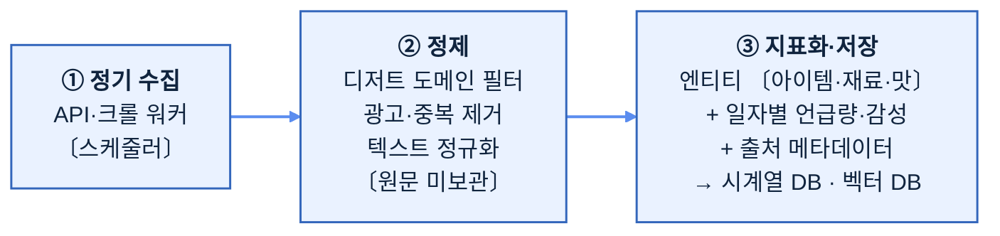

# 04. 인터넷 데이터 활용 방법 (자사 데이터 해자 + 인터넷 데이터 결합)

> **⚠️ 전제 업데이트(2026-06-18)**: 기존의 "보유 데이터 없음" 전제는 **폐기**되었다. 딸기로(딸기로픽, 동일 법인)는 이미 **자사 실거래 데이터**(매출·구매 퍼널·팝업별 브랜드 성과·고객 클러스터·키워드 취향·재구매율·배송지 분포)와 **픽미팀과의 정식 공동연구 산출물**(디저트 트렌드 분석·가게 랭킹 대시보드 + 분석 방법론 4종 — 시계열·키워드·가게 등급산식·클러스터링, 상세 [07](07_픽미공동연구_분석방법론.md))을 보유한다 → **데이터 해자**.
>
> 따라서 이 문서의 인터넷 공개 데이터는 *유일 수단*이 아니라 **자사 데이터의 커버리지 한계(전국 비입점 업체·신규 트렌드)를 메우는 보완축**으로 쓴다. 두 데이터의 결합이 콜드스타트·검증·개인화 모두에서 단독 인터넷 데이터보다 강하다. (개발 인력은 충분하다고 가정)

🛠 **이 문서의 기술들을 제로베이스에서 직접 셋팅하려면** → [`guides/` 단계별 실습 가이드](guides/00_인덱스_및_사전준비.md) (개발환경 · 네이버/구글/유튜브 API · 크롤링 · DB · Claude · 스케줄러 · 스코어링/백테스팅).

---

## 0. 핵심 원칙

1. **공식 API 우선, 크롤링은 보조**: 법적 리스크·안정성 때문에 API가 있으면 무조건 API. (TIPS 제안 시 "합법적 데이터 거버넌스"로 어필)
2. **메타데이터·통계 중심 수집**: 원문 전체를 저장·재배포하지 않고, 언급량·키워드·감성·링크 등 **지표화된 데이터**를 보관 → 저작권·개인정보 리스크 최소화.
3. **점진적 소스 확대**: 처음부터 모든 소스를 붙이지 말고, 신호 대비 비용이 좋은 2～3개로 시작 → 검증 후 확대.

---

## 1. 소스별 접근 방법 (무료 vs 유료, 합법성)

| 소스 | 접근 수단 | 비용 | 합법성·주의 | 우선순위 |
|------|-----------|------|-------------|----------|
| **네이버 검색 트렌드** | 네이버 데이터랩 API (`datalab/search`) | 무료 | 공식 API, 키워드 검색량 추이 제공 | ⭐ MVP |
| **네이버 뉴스/블로그** | 네이버 검색 오픈 API | 무료(일 호출 한도) | 공식 API. 메타데이터+요약 수집 | ⭐ MVP |
| **구글 트렌드** | `pytrends`(비공식) / 공식 페이지 | 무료 | 비공식 라이브러리는 rate limit·차단 주의 | ⭐ MVP |
| **유튜브** | YouTube Data API v3 | 무료(쿼터제) | 공식 API. 디저트 키워드 영상 조회수·댓글수 | 1차 확대 |
| **인스타그램** | Instagram Graph API(비즈니스 계정) | 무료(제한적) | 해시태그 검색 제한 큼. 합법 범위 작음 | 신중 |
| **틱톡** | TikTok 공식 API / 리서치 API | 무료～심사 | 바이럴 선행지표지만 접근 까다로움 | 후순위 |
| **커뮤니티(카페/디시 등)** | 크롤링 | 무료 | robots.txt·약관 확인 필수, 개인정보 배제 | 신중 |
| **배달앱 인기메뉴** | 크롤링(공개 페이지) | 무료 | 약관 확인, 과도한 호출 금지 | 1차 확대 |
| **해외 디저트 트렌드** | 해외 매체 RSS, 구글 뉴스 | 무료 | K-디저트의 6～12개월 선행지표 | 1차 확대 |
| **상용 SNS 분석 데이터** | 썸트렌드/바이브 등 유료 솔루션 | 유료(월 구독) | 자체 구축 부담 줄이는 대안 | 선택 |

> **MVP는 무료 공식 API 3종(네이버 데이터랩 + 네이버 검색 + 구글 트렌드)만으로 시작 가능** → 초기 데이터 비용 사실상 0원.

## 2. 콜드스타트 극복 전략 (자사 데이터로 일부 해소)

> 자사 실거래 데이터(딸기로픽) 보유로 콜드스타트는 **부분 해소**됐다 — 실제 판매·전환·재구매가 곧 정답(label) 역할을 한다. 다만 자사 데이터는 *입점/판매된 아이템*에 국한되므로, **아직 안 판 신규 트렌드·전국 비입점 업체**에 대해서는 아래 전략을 계속 쓴다.

1. **과거 트렌드 역추적(백테스팅)**: 약과·두바이초콜릿·소금빵 등 **이미 흥망이 끝난 아이템**의 과거 데이터를 수집 → 시스템이 "성장기 진입"을 며칠 전에 잡았을지 시뮬레이션. → 모델 검증의 정답지로 활용.
2. **해외 선행지표 활용**: 일본·유럽에서 먼저 뜬 아이템을 국내 진입 전에 포착(국내 데이터가 적어도 됨).
3. **규칙 기반 v1 → 학습 기반 v2**: 처음엔 "언급 증가율 + 감성 + 소스 다양성" 가중합 같은 **휴리스틱 스코어**로 시작(학습 데이터 불필요) → 서비스 운영하며 모인 피드백으로 점차 ML 고도화.
4. **LLM의 사전지식 활용**: Claude 등 LLM은 디저트 도메인 상식·과거 트렌드를 이미 알고 있어, 초기 "이건 왜 뜨는가/누가 만들면 좋은가" 해석을 데이터 없이도 보조 가능.

## 3. 수집 → 정제 → 지표화 파이프라인

- **디저트 도메인 필터**: 사전 + LLM 분류로 "디저트 관련 글"만 통과. 광고·체험단 글은 별도 플래그(신뢰도 가중에 반영).
- **지표화**: 저장하는 것은 원문이 아니라 **"2026-06-15, '두바이초콜릿', 언급 1,240건, 긍정 78%, 출처 네이버블로그"** 같은 **집계 지표**. → 가볍고, 합법적이고, 분석에 바로 쓰임.

## 4. LLM(Claude)을 어디에 쓰나 — 비용 관점 분리

| 작업 | LLM 필요? | 모델 티어 | 이유 |
|------|-----------|-----------|------|
| 언급량 집계·증가율 계산 | ❌ (코드로) | — | 단순 통계, LLM은 낭비·환각 위험 |
| 디저트 글 여부 분류 | ✅ 대량 | **Haiku**(저가) | 건수 많고 단순 → 최저가 모델 |
| 신조어/신메뉴 발견 | ✅ | Haiku～Sonnet | 신규성 판단 |
| 감성/뉘앙스 분석 | ✅ 대량 | **Haiku** | 대량 처리, 비용 최적화 |
| "왜 뜨는가/누가 만들면 좋은가" 인사이트 | ✅ 소량·고품질 | **Sonnet/Opus** | 전략 브리핑, 품질 중요 |

> 핵심: **계산은 코드, 해석·생성은 LLM**으로 책임 분리(환각 통제) + **건수 많은 작업은 저가 모델, 고부가 작업만 고급 모델**(비용 최적화). 구체 단가·산정은 [05_비용가이드.md](05_비용가이드.md) 참조.

🧩 **파이프라인 골격(공통)**: 위 분류·감성·인사이트 단계와 안건 2의 검색·랭킹은 **LangChain·LangGraph·RAG**(검색증강생성)로 묶어 *단계별 재시도·근거 결박·되묻기 루프*가 있는 검증 가능한 그래프로 구성한다(안건 1·2 공유 인프라). RAG는 위 "근거(citation) 강제" 원칙을 *구조적으로* 강제하는 메커니즘이다. 실습: [guides/10](guides/10_LangChain_LangGraph_RAG.md), 설계 맥락: [02 §5.5](02_트렌드분석추천시스템_기획.md)·[03 §6.2](03_자연어추천랭킹시스템_기획.md).

## 5. 법적·윤리 체크리스트 (TIPS 신뢰도 가점 요소)

- [ ] 각 소스의 robots.txt / 이용약관 / API 약관 확인·문서화
- [ ] 공식 API 있는 곳은 API 사용 (크롤링 지양)
- [ ] 개인정보(작성자 식별정보) 미수집·미저장
- [ ] 원문 전재·재배포 금지, **지표/요약만 보관**
- [ ] 호출 빈도 제한 준수(서버 부하 유발 금지)
- [ ] 저작권 있는 이미지·텍스트 무단 활용 금지
- [ ] (권장) 데이터 출처·수집정책을 서비스에 명시

## 6. 단계별 데이터 소스 로드맵 (요약)

- **Phase 0～1 (MVP)**: 네이버 데이터랩 + 네이버 검색 API + 구글 트렌드. 무료, 합법, 즉시 시작.
- **Phase 2**: 유튜브 API + 배달앱 인기메뉴 + 해외 RSS 추가. 백테스팅으로 모델 검증.
- **Phase 3**: 상용 SNS 분석/이미지 트렌드, (확보 시) 자사 거래 데이터 결합.

> 자세한 진입 단계는 [02_트렌드분석추천시스템_기획.md](02_트렌드분석추천시스템_기획.md) §9 로드맵과 연동.
